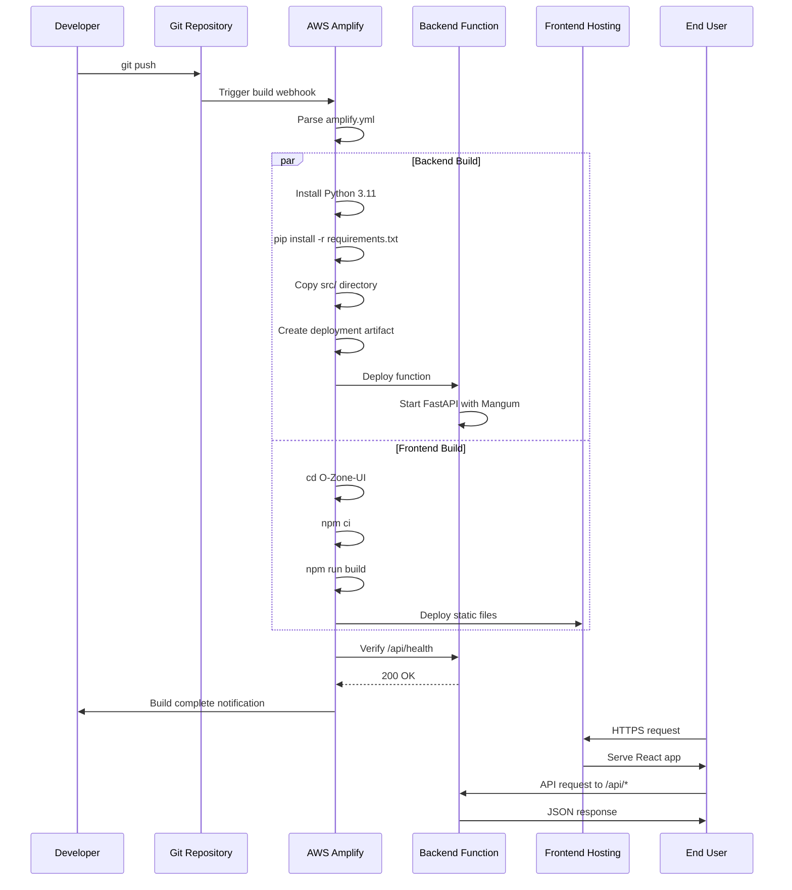

# Design Document: Amplify Backend Deployment

## Overview

This design enables unified deployment of the O-Zone FastAPI backend alongside the React frontend through AWS Amplify's build system. Currently, the frontend deploys automatically via amplify.yml while the backend requires manual Lambda packaging and deployment through a PowerShell script. This creates a fragmented deployment workflow that is error-prone and time-consuming.

The solution extends the existing amplify.yml configuration to include a backend build phase that installs Python dependencies, packages the FastAPI application, and deploys it as a serverless function accessible via a stable API endpoint. This consolidates both frontend and backend deployment into a single automated process triggered by Git commits.

Key design decisions:
- Use Amplify's built-in support for backend functions rather than external Lambda deployment
- Leverage Mangum adapter to make FastAPI compatible with AWS Lambda/API Gateway
- Maintain backward compatibility with existing frontend deployment configuration
- Configure CORS to allow frontend-backend communication
- Implement health check endpoint for deployment verification

## Architecture

### High-Level Architecture

```mermaid
graph TB
    subgraph "Git Repository"
        A[amplify.yml]
        B[O-Zone-UI/]
        C[src/api/]
        D[requirements.txt]
    end
    
    subgraph "AWS Amplify Build System"
        E[Backend Build Phase]
        F[Frontend Build Phase]
        E --> G[Python 3.11 Runtime]
        E --> H[Install Dependencies]
        E --> I[Package Backend]
        F --> J[npm ci]
        F --> K[npm run build]
    end
    
    subgraph "AWS Amplify Hosting"
        L[Static Frontend]
        M[Backend Function]
        N[API Gateway]
    end
    
    A --> E
    A --> F
    C --> E
    D --> E
    B --> F
    
    I --> M
    K --> L
    M --> N
    L --> O[HTTPS Endpoint]
    N --> P[/api/* Routes]
    
    subgraph "User Browser"
        Q[React App]
    end
    
    O --> Q
    Q --> P
```

### Deployment Flow



### Component Interaction

```mermaid
graph LR
    subgraph "Frontend (React)"
        A[React Components]
        B[API Client]
    end
    
    subgraph "API Gateway"
        C[/api/health]
        D[/api/locations]
        E[/api/chat]
        F[/api/recommendations]
        G[/api/map-stations]
    end
    
    subgraph "Backend Function (FastAPI)"
        H[FastAPI App]
        I[CORS Middleware]
        J[Mangum Handler]
        K[Health Router]
        L[Locations Router]
        M[Chat Router]
        N[Recommendations Router]
        O[Map Router]
    end
    
    subgraph "External Services"
        P[AWS Bedrock]
        Q[OpenAQ API]
    end
    
    A --> B
    B --> C
    B --> D
    B --> E
    B --> F
    B --> G
    
    C --> J
    D --> J
    E --> J
    F --> J
    G --> J
    
    J --> I
    I --> H
    H --> K
    H --> L
    H --> M
    H --> N
    H --> O
    
    M --> P
    L --> Q
    N --> Q
```

## Components and Interfaces

### 1. amplify.yml Configuration

The amplify.yml file is the central configuration that orchestrates the entire build and deployment process.

**Structure:**
```yaml
version: 1

backend:
  phases:
    preBuild:
      commands:
        - pip install --upgrade pip
        - pip install -r requirements.txt -t ./backend_package
        - cp -r src ./backend_package/
    build:
      commands:
        - echo "Backend build complete"
  artifacts:
    baseDirectory: backend_package
    files:
      - '**/*'

frontend:
  phases:
    preBuild:
      commands:
        - cd O-Zone-UI
        - npm ci
    build:
      commands:
        - npm run build
  artifacts:
    baseDirectory: O-Zone-UI/dist
    files:
      - '**/*'
  cache:
    paths:
      - O-Zone-UI/node_modules/**/*
```

**Key Configuration Elements:**

- **Backend Phase Ordering**: Backend builds before frontend to ensure API is available for frontend build-time checks
- **Dependency Installation**: Uses pip with `-t` flag to install dependencies into a target directory for Lambda compatibility
- **Source Code Packaging**: Copies entire src/ directory to maintain module structure
- **Artifact Definition**: Specifies backend_package as the deployment artifact containing all code and dependencies
- **Frontend Isolation**: Frontend build remains unchanged to maintain backward compatibility

### 2. FastAPI Application (src/api/main.py)

The FastAPI application serves as the backend API, already configured with Mangum for Lambda compatibility.

**Current Implementation:**
```python
from fastapi import FastAPI
from fastapi.middleware.cors import CORSMiddleware
from mangum import Mangum

app = FastAPI(
    title="O-Zone API",
    description="Air quality decision platform API",
    version="1.0.0",
    docs_url="/api/docs",
    redoc_url="/api/redoc",
    openapi_url="/api/openapi.json"
)

# CORS configuration
app.add_middleware(
    CORSMiddleware,
    allow_origins=["*"],
    allow_credentials=True,
    allow_methods=["*"],
    allow_headers=["*"],
)

# Routers
app.include_router(health.router, prefix="/api", tags=["Health"])
app.include_router(locations.router, prefix="/api", tags=["Locations"])
app.include_router(chat.router, prefix="/api", tags=["Chat"])
app.include_router(recommendations.router, prefix="/api", tags=["Recommendations"])
app.include_router(map_stations.router, prefix="/api", tags=["Map"])

# Lambda handler
handler = Mangum(app)
```

**Interface:**
- **Entry Point**: `handler` function exported for Lambda invocation
- **CORS Policy**: Configured to allow all origins (suitable for hackathon demo)
- **Route Prefix**: All routes use `/api` prefix for clear separation from frontend routes
- **Documentation**: OpenAPI docs available at `/api/docs` for development

**Design Rationale:**
- Mangum adapter translates API Gateway events to ASGI format that FastAPI understands
- CORS middleware handles preflight OPTIONS requests automatically
- Route prefix prevents conflicts with frontend routing

### 3. Environment Variables

Environment variables provide runtime configuration without hardcoding sensitive credentials.

**Required Variables:**

| Variable | Purpose | Example Value |
|----------|---------|---------------|
| AWS_REGION | AWS service region | us-east-1 |
| AWS_ACCESS_KEY_ID | AWS authentication | AKIA... |
| AWS_SECRET_ACCESS_KEY | AWS authentication | secret... |
| BEDROCK_MODEL_ID | AI model identifier | arn:aws:bedrock:... |
| OPENAQ_API_KEY | OpenAQ API access | 0ff845... |

**Configuration Location:**
- Set in Amplify Console under App Settings > Environment Variables
- Automatically injected into backend function runtime
- Accessed via `os.environ` in Python code

**Fallback Behavior:**
```python
# Example from config.py
AWS_REGION = os.getenv("AWS_REGION", "us-east-1")
BEDROCK_MODEL_ID = os.getenv("BEDROCK_MODEL_ID", "default-model-id")
```

### 4. API Gateway Integration

Amplify automatically creates an API Gateway endpoint when backend functions are deployed.

**Endpoint Structure:**
```
https://{app-id}.amplifyapp.com/api/*
```

**Route Mapping:**
- `/api/health` → Health check endpoint
- `/api/locations` → Location search and AQI data
- `/api/chat` → AI chatbot interactions
- `/api/recommendations` → Activity recommendations
- `/api/map-stations` → Global air quality stations

**Request Flow:**
1. Browser sends HTTPS request to Amplify domain
2. Amplify routing layer checks path prefix
3. Requests with `/api/*` route to backend function
4. Other requests serve static frontend files
5. Backend function processes request via Mangum handler
6. Response returns through API Gateway to browser

### 5. Health Check Endpoint

The health check endpoint verifies backend deployment and provides service status.

**Implementation (src/api/routers/health.py):**
```python
from fastapi import APIRouter

router = APIRouter()

@router.get("/health")
async def health_check():
    return {
        "status": "healthy",
        "service": "O-Zone API",
        "version": "1.0.0"
    }
```

**Response Format:**
```json
{
  "status": "healthy",
  "service": "O-Zone API",
  "version": "1.0.0"
}
```

**Usage:**
- Amplify build system calls this endpoint post-deployment to verify success
- Frontend can call this endpoint to check backend availability
- Monitoring systems can use this for uptime checks

## Data Models

### Build Artifact Structure

The backend deployment artifact contains all code and dependencies in a Lambda-compatible structure.

```
backend_package/
├── src/
│   ├── __init__.py
│   ├── api/
│   │   ├── __init__.py
│   │   ├── main.py          # FastAPI app with handler
│   │   ├── session.py
│   │   └── routers/
│   │       ├── __init__.py
│   │       ├── health.py
│   │       ├── locations.py
│   │       ├── chat.py
│   │       ├── recommendations.py
│   │       └── map_stations.py
│   ├── chatbot/
│   │   ├── __init__.py
│   │   ├── bedrock_adapter.py
│   │   ├── conversation_manager.py
│   │   └── ...
│   ├── config.py
│   ├── models.py
│   ├── data_fetcher.py
│   ├── aqi_calculator.py
│   └── ...
├── fastapi/                 # Installed dependencies
├── mangum/
├── boto3/
├── httpx/
├── pydantic/
└── ... (other dependencies)
```

**Key Characteristics:**
- Flat dependency structure at root level (Lambda requirement)
- Source code in src/ subdirectory maintains module imports
- No .pyc files or __pycache__ directories (excluded during copy)
- No .env files (environment variables come from Amplify configuration)

### API Request/Response Models

The backend uses Pydantic models for request validation and response serialization.

**Location Request:**
```python
class LocationRequest(BaseModel):
    city: str
    country: Optional[str] = None
```

**AQI Response:**
```python
class AQIResponse(BaseModel):
    location: str
    aqi: int
    category: str  # "Good", "Moderate", "Unhealthy", etc.
    pollutants: Dict[str, float]
    timestamp: datetime
    recommendations: List[str]
```

**Chat Request:**
```python
class ChatRequest(BaseModel):
    message: str
    session_id: Optional[str] = None
    context: Optional[Dict[str, Any]] = None
```

**Chat Response:**
```python
class ChatResponse(BaseModel):
    response: str
    session_id: str
    suggestions: List[str]
    timestamp: datetime
```

### Environment Configuration Model

```python
class Config:
    AWS_REGION: str
    AWS_ACCESS_KEY_ID: str
    AWS_SECRET_ACCESS_KEY: str
    BEDROCK_MODEL_ID: str
    OPENAQ_API_KEY: str
    
    @classmethod
    def from_env(cls):
        """Load configuration from environment variables"""
        return cls(
            AWS_REGION=os.getenv("AWS_REGION", "us-east-1"),
            AWS_ACCESS_KEY_ID=os.getenv("AWS_ACCESS_KEY_ID", ""),
            AWS_SECRET_ACCESS_KEY=os.getenv("AWS_SECRET_ACCESS_KEY", ""),
            BEDROCK_MODEL_ID=os.getenv("BEDROCK_MODEL_ID", ""),
            OPENAQ_API_KEY=os.getenv("OPENAQ_API_KEY", "")
        )
```


## Correctness Properties

A property is a characteristic or behavior that should hold true across all valid executions of a system—essentially, a formal statement about what the system should do. Properties serve as the bridge between human-readable specifications and machine-verifiable correctness guarantees.

### Property 1: Mangum Handler Invocation

For any valid API Gateway event (GET, POST, PUT, DELETE requests to any /api/* endpoint), the Mangum handler should successfully process the event and return a valid API Gateway response with appropriate status code and headers.

**Validates: Requirements 2.5**

### Property 2: Environment Variable Fallback

For any missing environment variable from the set {AWS_REGION, AWS_ACCESS_KEY_ID, AWS_SECRET_ACCESS_KEY, BEDROCK_MODEL_ID, OPENAQ_API_KEY}, the application should log a warning message identifying the missing variable and use a documented default value where applicable.

**Validates: Requirements 3.6, 9.3**

### Property 3: API Prefix Routing

For any HTTP request with a path starting with /api/, the FastAPI application should route the request to the appropriate endpoint handler and return a response, while requests without the /api/ prefix should not be processed by the backend.

**Validates: Requirements 4.3**

### Property 4: CORS Headers in Responses

For any HTTP request to any backend endpoint, the response should include CORS headers (Access-Control-Allow-Origin, Access-Control-Allow-Methods, Access-Control-Allow-Headers, Access-Control-Allow-Credentials) that permit cross-origin requests from the frontend.

**Validates: Requirements 5.1, 5.2, 5.3, 5.4**

### Property 5: CORS Preflight Handling

For any OPTIONS request to any /api/* endpoint, the backend should respond with status 200 and include all required CORS headers (Access-Control-Allow-Origin, Access-Control-Allow-Methods, Access-Control-Allow-Headers, Access-Control-Allow-Credentials) without invoking the actual endpoint handler.

**Validates: Requirements 5.5**

### Example Test 1: Health Check Endpoint

The /api/health endpoint should return HTTP status 200 with a JSON response containing {"status": "healthy", "service": "O-Zone API", "version": "1.0.0"}.

**Validates: Requirements 6.1, 6.2, 6.3**

### Example Test 2: Request Timeout Handling

When a request exceeds the configured timeout threshold, the backend should return HTTP status 504 with a JSON response containing an appropriate timeout error message.

**Validates: Requirements 10.5**

## Error Handling

### Build-Time Errors

**Dependency Installation Failures:**
- Amplify build system will halt if pip install fails
- Error logs will show the specific package and error message
- Common causes: incompatible package versions, network issues, missing system dependencies
- Resolution: Update requirements.txt with compatible versions, check Amplify build environment specifications

**Source Code Copy Failures:**
- Build will fail if src/ directory is missing or inaccessible
- Error logs will show file system errors
- Resolution: Verify repository structure, check .gitignore doesn't exclude src/

**Artifact Creation Failures:**
- Build will fail if artifact size exceeds Lambda limits (250 MB unzipped, 50 MB zipped)
- Error logs will show size limit errors
- Resolution: Remove unnecessary dependencies, use Lambda layers for large packages

### Runtime Errors

**Missing Environment Variables:**
```python
# config.py error handling
def get_required_env(var_name: str, default: Optional[str] = None) -> str:
    value = os.getenv(var_name, default)
    if value is None or value == "":
        logger.warning(f"Environment variable {var_name} is not set")
        if default is None:
            raise ValueError(f"Required environment variable {var_name} is missing")
    return value
```

**API Request Errors:**
- 400 Bad Request: Invalid request parameters (e.g., missing required fields)
- 401 Unauthorized: Missing or invalid authentication credentials
- 404 Not Found: Endpoint does not exist
- 500 Internal Server Error: Unhandled exception in backend code
- 502 Bad Gateway: Backend function failed to start or crashed
- 504 Gateway Timeout: Request exceeded 30-second timeout

**External Service Errors:**
```python
# Example error handling for OpenAQ API
try:
    response = await httpx_client.get(openaq_url, timeout=10.0)
    response.raise_for_status()
    return response.json()
except httpx.TimeoutException:
    logger.error("OpenAQ API request timed out")
    raise HTTPException(status_code=504, detail="External API timeout")
except httpx.HTTPStatusError as e:
    logger.error(f"OpenAQ API returned error: {e.response.status_code}")
    raise HTTPException(status_code=502, detail="External API error")
```

**AWS Bedrock Errors:**
```python
# Example error handling for Bedrock
try:
    response = bedrock_client.invoke_model(
        modelId=model_id,
        body=json.dumps(request_body)
    )
    return json.loads(response['body'].read())
except ClientError as e:
    error_code = e.response['Error']['Code']
    if error_code == 'ThrottlingException':
        logger.error("Bedrock API rate limit exceeded")
        raise HTTPException(status_code=429, detail="AI service rate limit")
    elif error_code == 'AccessDeniedException':
        logger.error("Bedrock API access denied")
        raise HTTPException(status_code=403, detail="AI service access denied")
    else:
        logger.error(f"Bedrock API error: {error_code}")
        raise HTTPException(status_code=502, detail="AI service error")
```

### Error Response Format

All error responses follow a consistent JSON structure:

```json
{
  "error": {
    "code": "ERROR_CODE",
    "message": "Human-readable error message",
    "details": {
      "field": "Additional context"
    }
  },
  "timestamp": "2024-01-15T10:30:00Z",
  "path": "/api/endpoint"
}
```

### Logging Strategy

**Log Levels:**
- DEBUG: Detailed diagnostic information (disabled in production)
- INFO: General informational messages (successful requests, startup events)
- WARNING: Non-critical issues (missing optional config, fallback to defaults)
- ERROR: Error conditions that don't crash the application (failed API calls, validation errors)
- CRITICAL: Severe errors that may cause application failure

**Log Format:**
```python
import logging

logging.basicConfig(
    level=logging.INFO,
    format='%(asctime)s - %(name)s - %(levelname)s - %(message)s'
)

logger = logging.getLogger(__name__)
```

**What to Log:**
- All API requests (method, path, status code, duration)
- Environment variable loading (warnings for missing vars)
- External API calls (URL, status, duration)
- Error conditions (full exception details)
- Health check calls (for monitoring)

## Testing Strategy

### Dual Testing Approach

This feature requires both unit tests and property-based tests to ensure comprehensive coverage:

**Unit Tests** verify specific examples, edge cases, and error conditions:
- Health check endpoint returns expected response
- Timeout handling returns 504 status
- Specific CORS headers are present
- Error responses follow the correct format
- Integration between FastAPI routers

**Property-Based Tests** verify universal properties across all inputs:
- Mangum handler processes any valid API Gateway event
- CORS headers are present in all responses
- Missing environment variables trigger warnings
- API prefix routing works for all paths
- Preflight OPTIONS requests are handled correctly

Together, these approaches provide comprehensive coverage: unit tests catch concrete bugs in specific scenarios, while property tests verify general correctness across a wide range of inputs.

### Property-Based Testing Configuration

**Testing Library:** We will use Hypothesis for Python property-based testing.

**Test Configuration:**
- Each property test will run a minimum of 100 iterations to ensure thorough coverage through randomization
- Each test will include a comment tag referencing the design document property
- Tag format: `# Feature: amplify-backend-deployment, Property {number}: {property_text}`

**Example Property Test Structure:**
```python
from hypothesis import given, strategies as st
import pytest

# Feature: amplify-backend-deployment, Property 1: Mangum Handler Invocation
@given(
    method=st.sampled_from(['GET', 'POST', 'PUT', 'DELETE']),
    path=st.text(min_size=1).map(lambda p: f'/api/{p}')
)
@pytest.mark.property_test
def test_mangum_handler_processes_api_gateway_events(method, path):
    """
    For any valid API Gateway event, the Mangum handler should successfully
    process the event and return a valid response.
    """
    event = create_api_gateway_event(method=method, path=path)
    response = handler(event, {})
    
    assert 'statusCode' in response
    assert 'headers' in response
    assert 'body' in response
    assert isinstance(response['statusCode'], int)
    assert 200 <= response['statusCode'] < 600
```

### Unit Test Coverage

**Required Unit Tests:**

1. **Health Check Tests:**
   - Test /api/health returns 200 status
   - Test response contains correct JSON structure
   - Test response includes version information

2. **CORS Tests:**
   - Test CORS headers present in GET requests
   - Test CORS headers present in POST requests
   - Test OPTIONS preflight returns 200
   - Test Access-Control-Allow-Credentials is true

3. **Environment Variable Tests:**
   - Test application starts with all env vars set
   - Test application logs warning when AWS_REGION missing
   - Test application uses default when BEDROCK_MODEL_ID missing
   - Test application raises error when required var missing

4. **Error Handling Tests:**
   - Test 404 returned for non-existent endpoint
   - Test 400 returned for invalid request body
   - Test 504 returned on timeout
   - Test error response format is correct

5. **Routing Tests:**
   - Test /api/locations routes to locations handler
   - Test /api/chat routes to chat handler
   - Test /api/recommendations routes to recommendations handler
   - Test /api/map-stations routes to map handler

### Integration Testing

**Local Testing:**
```bash
# Start FastAPI locally
uvicorn src.api.main:app --reload

# Test health endpoint
curl http://localhost:8000/api/health

# Test with API Gateway event simulation
python -c "from src.api.main import handler; print(handler({'httpMethod': 'GET', 'path': '/api/health'}, {}))"
```

**Amplify Preview Testing:**
- Create a pull request to trigger Amplify preview deployment
- Verify preview URL is accessible
- Test all API endpoints via preview URL
- Check CORS headers in browser console
- Verify environment variables are loaded correctly

**Production Testing:**
- Deploy to main branch
- Run smoke tests against production URL
- Monitor CloudWatch logs for errors
- Check health endpoint returns 200
- Verify frontend can communicate with backend

### Test Data Generation

**Hypothesis Strategies for Property Tests:**

```python
from hypothesis import strategies as st

# API Gateway event strategy
api_gateway_event = st.fixed_dictionaries({
    'httpMethod': st.sampled_from(['GET', 'POST', 'PUT', 'DELETE', 'OPTIONS']),
    'path': st.text(min_size=1).map(lambda p: f'/api/{p}'),
    'headers': st.dictionaries(
        keys=st.text(min_size=1, max_size=50),
        values=st.text(min_size=1, max_size=200)
    ),
    'body': st.one_of(st.none(), st.text()),
    'queryStringParameters': st.one_of(
        st.none(),
        st.dictionaries(
            keys=st.text(min_size=1, max_size=50),
            values=st.text(min_size=1, max_size=200)
        )
    )
})

# Environment variable strategy
env_var_set = st.sets(
    st.sampled_from([
        'AWS_REGION',
        'AWS_ACCESS_KEY_ID',
        'AWS_SECRET_ACCESS_KEY',
        'BEDROCK_MODEL_ID',
        'OPENAQ_API_KEY'
    ]),
    min_size=0,
    max_size=5
)
```

### Continuous Integration

**GitHub Actions Workflow:**
```yaml
name: Test Backend

on: [push, pull_request]

jobs:
  test:
    runs-on: ubuntu-latest
    steps:
      - uses: actions/checkout@v2
      - uses: actions/setup-python@v2
        with:
          python-version: '3.11'
      - name: Install dependencies
        run: |
          pip install -r requirements.txt
          pip install hypothesis pytest pytest-cov
      - name: Run unit tests
        run: pytest tests/unit -v
      - name: Run property tests
        run: pytest tests/property -v --hypothesis-show-statistics
      - name: Generate coverage report
        run: pytest --cov=src --cov-report=html
```

This ensures all tests run automatically on every commit and pull request, catching issues before deployment.
