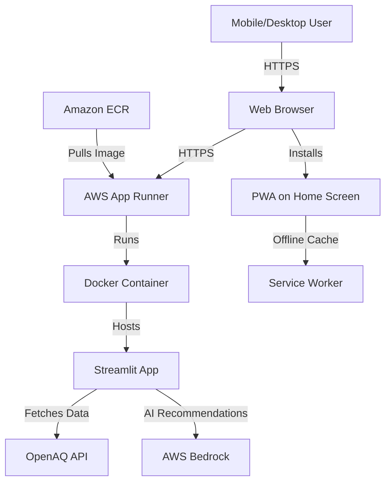

# Design Document: Mobile-Responsive Deployment

## Overview

This design transforms the O-Zone Streamlit air quality monitoring application into a mobile-responsive Progressive Web App (PWA) deployed on AWS App Runner. The solution focuses on essential features needed for a hackathon presentation while minimizing AWS costs and implementation complexity.

### Design Goals

1. **Mobile-First Responsiveness**: Adapt the existing desktop-optimized Streamlit app to work seamlessly on mobile devices (320px-768px), tablets (769px-1024px), and desktops (1025px+)
2. **PWA Capabilities**: Enable installation on mobile home screens with offline support
3. **Cost-Optimized Cloud Deployment**: Deploy to AWS App Runner with auto-pause and minimal resource allocation
4. **Rapid Implementation**: Design for same-day implementation with minimal refactoring of existing code
5. **Performance**: Achieve sub-3-second load times on 3G mobile connections

### Key Constraints

- Hackathon timeline: Implementation must be completed in one day
- Budget: Minimize AWS costs through auto-pause and minimal instance sizing
- Existing codebase: Preserve current functionality while adding responsive capabilities
- Streamlit limitations: Work within Streamlit's CSS injection and configuration constraints

## Architecture

### High-Level Architecture



### Component Architecture

The application consists of three main architectural layers:

1. **Presentation Layer** (Mobile-Responsive UI)
   - Custom CSS injection for responsive breakpoints
   - Streamlit page configuration
   - Touch-friendly component sizing
   - PWA manifest and service worker

2. **Application Layer** (Existing Streamlit App)
   - src/app.py: Main application entry point
   - src/chatbot/: AI recommendation engine
   - src/globe_visualizer.py: Interactive map component
   - src/aqi_calculator.py: Air quality calculations
   - src/data_fetcher.py: OpenAQ API integration

3. **Infrastructure Layer** (AWS Deployment)
   - Docker container with Python 3.11 and dependencies
   - AWS App Runner service with auto-scaling (1-2 instances)
   - Amazon ECR for container image storage
   - AWS Systems Manager Parameter Store for credentials

### Responsive Design Strategy

The design uses a **CSS injection approach** to add responsive styles to Streamlit's default rendering:

- **Streamlit Configuration**: Use `st.set_page_config()` to set viewport and theme
- **Custom CSS Injection**: Use `st.markdown()` with `unsafe_allow_html=True` to inject responsive CSS
- **Breakpoint Strategy**: Three breakpoints (768px, 1024px) for mobile, tablet, desktop
- **Component Adaptation**: Modify existing render functions to include responsive CSS classes

## Components and Interfaces

### 1. Responsive CSS Module

**File**: `src/responsive_styles.py`

**Purpose**: Centralize all responsive CSS styles and provide injection function

**Interface**:
```python
def get_responsive_css() -> str:
    """Returns complete responsive CSS as a string for injection into Streamlit"""
    
def inject_responsive_styles() -> None:
    """Injects responsive CSS into the current Streamlit page"""
```

**CSS Architecture**:
- Base styles: Touch target sizing (44px minimum), spacing (8px minimum)
- Mobile breakpoint (@media max-width: 768px): Single-column layout, stacked components
- Tablet breakpoint (@media min-width: 769px and max-width: 1024px): Two-column layout
- Desktop breakpoint (@media min-width: 1025px): Existing multi-column layout

**Key CSS Classes**:
- `.mobile-header`: Compact header for mobile devices
- `.mobile-stack`: Vertical stacking for mobile components
- `.touch-target`: Minimum 44x44px sizing for interactive elements
- `.collapsible-section`: Expandable sections for mobile navigation

### 2. PWA Configuration Module

**File**: `src/pwa_config.py`

**Purpose**: Generate PWA manifest and service worker files

**Interface**:
```python
def generate_manifest() -> dict:
    """Returns manifest.json content as dictionary"""
    
def generate_service_worker() -> str:
    """Returns service worker JavaScript code as string"""
    
def setup_pwa_files() -> None:
    """Creates manifest.json and sw.js in static directory"""
```

**Manifest Structure**:
```json
{
  "name": "O-Zone Air Quality Monitor",
  "short_name": "O-Zone",
  "start_url": "/",
  "display": "standalone",
  "background_color": "#ffffff",
  "theme_color": "#1f77b4",
  "icons": [
    {"src": "/static/icon-192.png", "sizes": "192x192", "type": "image/png"},
    {"src": "/static/icon-512.png", "sizes": "512x512", "type": "image/png"}
  ]
}
```

**Service Worker Strategy**:
- Cache-first strategy for static assets (CSS, JS, icons)
- Network-first strategy for API calls (OpenAQ, Bedrock)
- Offline fallback page for when network is unavailable

### 3. Modified App Entry Point

**File**: `src/app.py` (modifications)

**Changes**:
1. Add responsive CSS injection at app startup
2. Add PWA meta tags in page config
3. Modify render functions to include responsive CSS classes
4. Add mobile navigation logic

**Modified Functions**:
```python
def main():
    # Add: Inject responsive styles
    inject_responsive_styles()
    # Add: Setup PWA files
    setup_pwa_files()
    # Existing: Initialize session state and render components
    
def render_location_input():
    # Add: Mobile-specific compact layout
    # Add: CSS classes for responsive behavior
    
def render_globe_view():
    # Add: Lazy loading for mobile performance
    # Add: Touch-friendly controls
```

### 4. Docker Container

**File**: `Dockerfile`

**Purpose**: Package application with all dependencies for consistent deployment

**Structure**:
```dockerfile
FROM python:3.11-slim
WORKDIR /app
COPY requirements.txt .
RUN pip install --no-cache-dir -r requirements.txt
COPY src/ ./src/
COPY static/ ./static/
EXPOSE 8501
HEALTHCHECK CMD curl --fail http://localhost:8501/_stcore/health || exit 1
CMD ["streamlit", "run", "src/app.py", "--server.port=8501", "--server.address=0.0.0.0"]
```

**Optimization Strategies**:
- Use slim Python base image to reduce size
- Multi-stage build not needed (simple app)
- No-cache pip install to reduce layer size
- Health check for App Runner monitoring

### 5. AWS App Runner Configuration

**File**: `apprunner.yaml`

**Purpose**: Define App Runner service configuration

**Configuration**:
```yaml
version: 1.0
runtime: python311
build:
  commands:
    build:
      - pip install -r requirements.txt
run:
  runtime-version: 3.11
  command: streamlit run src/app.py --server.port=8501 --server.address=0.0.0.0
  network:
    port: 8501
  env:
    - name: AWS_DEFAULT_REGION
      value: us-east-1
```

**Service Settings** (via AWS CLI/Console):
- CPU: 1 vCPU
- Memory: 2 GB
- Auto-scaling: Min 1, Max 2 instances
- Auto-pause: 5 minutes of inactivity
- Health check: HTTP GET /_stcore/health

### 6. Deployment Automation

**File**: `deploy.sh`

**Purpose**: Automate build, push, and deployment process

**Interface**:
```bash
#!/bin/bash
# Usage: ./deploy.sh [aws-region] [ecr-repo-name]

build_docker_image()
push_to_ecr()
create_or_update_apprunner()
```

**Deployment Steps**:
1. Build Docker image locally
2. Tag image with ECR repository URL
3. Push image to Amazon ECR
4. Create or update App Runner service
5. Wait for deployment to complete
6. Output public URL

## Data Models

### Responsive Breakpoint Model

```python
@dataclass
class ResponsiveBreakpoint:
    name: str  # "mobile", "tablet", "desktop"
    min_width: int  # Minimum width in pixels
    max_width: Optional[int]  # Maximum width in pixels (None for desktop)
    columns: int  # Number of columns in layout
    
BREAKPOINTS = [
    ResponsiveBreakpoint("mobile", 320, 768, 1),
    ResponsiveBreakpoint("tablet", 769, 1024, 2),
    ResponsiveBreakpoint("desktop", 1025, None, 3)
]
```

### PWA Manifest Model

```python
@dataclass
class PWAIcon:
    src: str
    sizes: str
    type: str

@dataclass
class PWAManifest:
    name: str
    short_name: str
    start_url: str
    display: str  # "standalone", "fullscreen", "minimal-ui"
    background_color: str
    theme_color: str
    icons: List[PWAIcon]
```

### App Runner Configuration Model

```python
@dataclass
class AppRunnerConfig:
    service_name: str
    cpu: str  # "1 vCPU", "2 vCPU"
    memory: str  # "2 GB", "4 GB"
    port: int
    auto_scaling_min: int
    auto_scaling_max: int
    auto_pause_minutes: int
    health_check_path: str
    
DEFAULT_CONFIG = AppRunnerConfig(
    service_name="ozone-air-quality",
    cpu="1 vCPU",
    memory="2 GB",
    port=8501,
    auto_scaling_min=1,
    auto_scaling_max=2,
    auto_pause_minutes=5,
    health_check_path="/_stcore/health"
)
```

### Performance Metrics Model

```python
@dataclass
class PerformanceMetrics:
    fcp: float  # First Contentful Paint in seconds
    lcp: float  # Largest Contentful Paint in seconds
    tti: float  # Time to Interactive in seconds
    connection_type: str  # "3G", "4G", "WiFi"
    
TARGET_METRICS = PerformanceMetrics(
    fcp=2.0,
    lcp=3.0,
    tti=4.0,
    connection_type="3G"
)
```


## Correctness Properties

*A property is a characteristic or behavior that should hold true across all valid executions of a system-essentially, a formal statement about what the system should do. Properties serve as the bridge between human-readable specifications and machine-verifiable correctness guarantees.*

### Property 1: Responsive CSS Contains Required Breakpoints

*For any* generated responsive CSS string, it must contain media query declarations at exactly 768px and 1024px breakpoints.

**Validates: Requirements 1.4**

### Property 2: Touch Targets Meet Accessibility Standards

*For any* generated responsive CSS string, all touch target selectors must specify minimum dimensions of 44px height and 44px width, and minimum spacing of 8px between adjacent targets.

**Validates: Requirements 2.1, 2.2, 2.3**

### Property 3: PWA Manifest Completeness

*For any* generated PWA manifest, it must contain all required fields (name, short_name, start_url, display set to "standalone", background_color, theme_color) and include icon entries for both 192x192 and 512x512 pixel sizes.

**Validates: Requirements 5.1, 5.2, 5.5**

### Property 4: Browser Detection Warnings

*For any* browser user agent string that represents an unsupported browser version (Chrome <90, Safari <14, Firefox <88, Edge <90), the browser detection function must return a warning message with supported browser recommendations.

**Validates: Requirements 7.5**

### Property 5: Location State Preservation

*For any* location selection and view mode (text input or globe view), when switching between view modes, the selected location data must remain unchanged in session state.

**Validates: Requirements 9.5**

## Error Handling

### CSS Injection Errors

**Scenario**: Malformed CSS or injection failure

**Handling Strategy**:
- Wrap CSS injection in try-except block
- Log error to Streamlit console
- Fall back to default Streamlit styles
- Display warning to user that responsive features may not work

```python
def inject_responsive_styles():
    try:
        css = get_responsive_css()
        st.markdown(f"<style>{css}</style>", unsafe_allow_html=True)
    except Exception as e:
        st.warning("⚠️ Responsive styles could not be loaded. Some features may not work on mobile.")
        logging.error(f"CSS injection failed: {e}")
```

### PWA File Generation Errors

**Scenario**: Unable to create manifest.json or service worker files

**Handling Strategy**:
- Catch file system errors during PWA setup
- Log error but don't crash the application
- PWA features will be unavailable but app remains functional
- Display info message that installation feature is unavailable

```python
def setup_pwa_files():
    try:
        # Generate and write manifest.json
        # Generate and write sw.js
    except (IOError, PermissionError) as e:
        logging.error(f"PWA setup failed: {e}")
        st.info("ℹ️ App installation feature is currently unavailable.")
```

### Docker Build Errors

**Scenario**: Missing dependencies or build failures

**Handling Strategy**:
- Use multi-stage error checking in Dockerfile
- Validate requirements.txt exists before pip install
- Use `--no-cache-dir` to avoid cache corruption
- Include clear error messages in build output

```dockerfile
RUN pip install --no-cache-dir -r requirements.txt || \
    (echo "ERROR: Failed to install dependencies. Check requirements.txt" && exit 1)
```

### AWS Deployment Errors

**Scenario**: ECR push failures, App Runner service creation errors, credential issues

**Handling Strategy**:
- Validate AWS credentials before deployment
- Check ECR repository exists before pushing
- Use AWS CLI error codes to provide specific guidance
- Implement retry logic for transient network errors

```bash
# In deploy.sh
if ! aws ecr describe-repositories --repository-names $REPO_NAME &>/dev/null; then
    echo "ERROR: ECR repository $REPO_NAME does not exist"
    echo "Create it with: aws ecr create-repository --repository-name $REPO_NAME"
    exit 1
fi
```

### API Rate Limiting

**Scenario**: OpenAQ API rate limits exceeded

**Handling Strategy**:
- Already handled by existing data_fetcher.py
- No changes needed for mobile deployment
- Maintain existing exponential backoff and caching

### AWS Bedrock Throttling

**Scenario**: Bedrock API throttling or quota exceeded

**Handling Strategy**:
- Already handled by existing bedrock_client.py
- No changes needed for mobile deployment
- Maintain existing retry logic and error messages

### Network Connectivity Errors

**Scenario**: User loses network connection while using PWA

**Handling Strategy**:
- Service worker provides offline fallback page
- Cache last successful API responses
- Display clear message when offline
- Automatically retry when connection restored

```javascript
// In service worker
self.addEventListener('fetch', (event) => {
  event.respondWith(
    fetch(event.request)
      .catch(() => caches.match('/offline.html'))
  );
});
```

## Testing Strategy

### Dual Testing Approach

This feature requires both unit tests and property-based tests to ensure comprehensive coverage:

- **Unit tests**: Verify specific examples, edge cases, and configuration files
- **Property tests**: Verify universal properties across all inputs (CSS generation, manifest generation, state management)

### Unit Testing

Unit tests focus on specific examples and configuration validation:

**CSS Generation Tests**:
- Test that `get_responsive_css()` returns non-empty string
- Test that CSS contains expected class names
- Test that CSS is valid (no syntax errors)

**PWA Configuration Tests**:
- Test manifest generation with specific app metadata
- Test service worker generation produces valid JavaScript
- Test icon file paths are correct

**Docker Configuration Tests**:
- Test Dockerfile contains Python 3.11 base image (Requirement 3.1)
- Test Dockerfile copies requirements.txt and runs pip install (Requirement 3.2)
- Test Dockerfile exposes port 8501 (Requirement 3.3)
- Test Dockerfile has CMD to launch Streamlit (Requirement 3.4)
- Test Dockerfile includes HEALTHCHECK instruction (Requirement 3.5)

**App Runner Configuration Tests**:
- Test apprunner.yaml references ECR (Requirement 4.1)
- Test configuration sets min=1, max=2 instances (Requirement 4.2)
- Test configuration includes environment variables (Requirement 4.5)
- Test configuration sets 1 vCPU (Requirement 8.1)
- Test configuration sets 2 GB memory (Requirement 8.2)
- Test configuration sets auto-pause to 5 minutes (Requirement 8.3)

**Deployment Script Tests**:
- Test deploy.sh exists and is executable (Requirement 10.3, 10.4)

**Component Tests**:
- Test lazy loading logic for globe visualization (Requirement 6.5)
- Test collapsible menu logic for historical trends (Requirement 9.3)
- Test no new AWS dependencies added (Requirement 8.5)

**Documentation Tests**:
- Test deployment documentation exists (Requirement 10.5)
- Test Dockerfile exists (Requirement 10.1)
- Test apprunner.yaml exists (Requirement 10.2)

### Property-Based Testing

Property tests verify universal properties across randomized inputs. Each test should run a minimum of 100 iterations.

**Test Library**: Use `hypothesis` (already in requirements.txt)

**Property Test 1: Responsive Breakpoints**
- **Property**: Property 1 from design document
- **Tag**: `# Feature: mobile-responsive-deployment, Property 1: Responsive CSS Contains Required Breakpoints`
- **Strategy**: Generate random CSS modifications, verify breakpoints always present
- **Generators**: Random whitespace, random additional CSS rules
- **Assertion**: CSS string contains `@media` queries at 768px and 1024px

**Property Test 2: Touch Target Sizing**
- **Property**: Property 2 from design document
- **Tag**: `# Feature: mobile-responsive-deployment, Property 2: Touch Targets Meet Accessibility Standards`
- **Strategy**: Parse CSS and verify all touch target selectors meet size requirements
- **Generators**: Random CSS class names for touch targets
- **Assertion**: All touch target rules have min-height: 44px, min-width: 44px, margin/padding: 8px

**Property Test 3: Manifest Validity**
- **Property**: Property 3 from design document
- **Tag**: `# Feature: mobile-responsive-deployment, Property 3: PWA Manifest Completeness`
- **Strategy**: Generate manifests with random app names and colors
- **Generators**: Random strings for name/short_name, random hex colors
- **Assertion**: All required fields present, display="standalone", icons include 192x192 and 512x512

**Property Test 4: Browser Detection**
- **Property**: Property 4 from design document
- **Tag**: `# Feature: mobile-responsive-deployment, Property 4: Browser Detection Warnings`
- **Strategy**: Generate random user agent strings for unsupported browsers
- **Generators**: Random browser versions below thresholds (Chrome <90, Safari <14, etc.)
- **Assertion**: Function returns warning message with browser recommendations

**Property Test 5: State Preservation**
- **Property**: Property 5 from design document
- **Tag**: `# Feature: mobile-responsive-deployment, Property 5: Location State Preservation`
- **Strategy**: Generate random location data and view modes, verify state unchanged after switch
- **Generators**: Random location strings, random view mode toggles
- **Assertion**: Location data in session state equals original after view mode change

### Integration Testing

Integration tests verify the deployed application works end-to-end:

**Manual Testing Checklist** (for hackathon demo):
- [ ] Deploy to App Runner and verify public URL accessible
- [ ] Test on actual mobile device (iPhone/Android)
- [ ] Test on tablet device (iPad/Android tablet)
- [ ] Test on desktop browser
- [ ] Verify PWA install prompt appears on mobile
- [ ] Install PWA and test offline functionality
- [ ] Verify touch targets are easily tappable
- [ ] Verify no horizontal scrolling on mobile
- [ ] Test location input on mobile
- [ ] Test globe view on mobile (touch controls)
- [ ] Verify chatbot recommendations work on mobile
- [ ] Check App Runner auto-pause after 5 minutes
- [ ] Verify deployment completes in under 10 minutes

**Performance Testing** (post-hackathon):
- Use Lighthouse to measure FCP, LCP, TTI on 3G
- Target: FCP <2s, LCP <3s, TTI <4s (Requirements 6.1, 6.2, 6.3)
- Use Chrome DevTools network throttling for 3G simulation

### Test Organization

```
tests/
├── unit/
│   ├── test_responsive_css.py          # CSS generation unit tests
│   ├── test_pwa_config.py              # PWA configuration unit tests
│   ├── test_docker_config.py           # Dockerfile validation tests
│   ├── test_apprunner_config.py        # App Runner config tests
│   └── test_deployment_files.py        # Deployment script tests
├── property/
│   ├── test_responsive_properties.py   # Properties 1-2
│   ├── test_pwa_properties.py          # Property 3
│   ├── test_browser_properties.py      # Property 4
│   └── test_state_properties.py        # Property 5
└── integration/
    └── test_deployment_manual.md       # Manual testing checklist
```

### Test Execution

Run all tests before deployment:
```bash
# Unit tests
pytest tests/unit/ -v

# Property tests (100 iterations each)
pytest tests/property/ -v --hypothesis-seed=random

# Coverage report
pytest --cov=src --cov-report=html
```

Target: 80% code coverage for new responsive and PWA modules.

