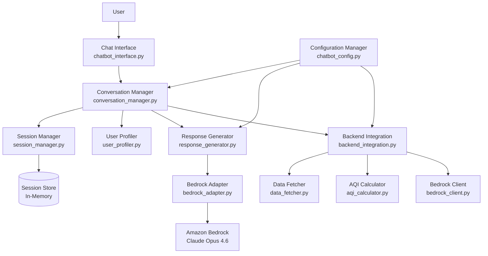

# Design Document: O-Zone Chatbot

## Overview

The O-Zone Chatbot provides a conversational interface for the O-Zone Air Quality Decision & Recommendations Platform. It guides users through location setup, activity selection, health profile configuration, and delivers personalized air quality recommendations through natural language interaction. The chatbot integrates with existing O-Zone MVP backend services and leverages Amazon Bedrock's Claude Opus 4.6 for adaptive communication that adjusts to user demographics, technical expertise, and communication preferences.

The chatbot is designed as a stateful conversational agent that maintains session context, handles multi-turn dialogues, and provides graceful error handling with clear user guidance. It serves as an alternative interface to the Streamlit web UI, offering a more guided and conversational experience particularly suited for users who prefer text-based interaction or need more structured guidance through the air quality decision process.

### Technology Stack

- **Chatbot Framework**: LangChain or custom state machine (Python)
- **LLM**: Amazon Bedrock Claude Opus 4.6 (for adaptive communication)
- **Backend Integration**: Existing O-Zone MVP services (data_fetcher.py, aqi_calculator.py, bedrock_client.py)
- **Session Management**: In-memory session store with TTL
- **Interface**: CLI-based or web-based chat interface (Streamlit chat components)
- **Testing**: pytest, Hypothesis (property-based testing)

### Key Design Principles

1. **Conversational Flow**: Natural dialogue patterns with clear prompts and confirmations
2. **Context Awareness**: Maintain session state across multi-turn conversations
3. **Adaptive Communication**: Adjust language complexity and explanation depth based on user profile
4. **Graceful Degradation**: Provide useful guidance even when backend services fail
5. **Error Recovery**: Clear error messages with actionable suggestions
6. **Modularity**: Separate concerns (conversation management, backend integration, user profiling)

## Architecture

### System Components



### Component Responsibilities

**chatbot_interface.py (Chat Interface)**
- Renders chat UI (CLI or Streamlit chat components)
- Handles user input and displays bot responses
- Manages conversation history display
- Provides input validation and sanitization
- Handles special commands (help, restart, change location)

**conversation_manager.py (Conversation Manager)**
- Orchestrates conversation flow through states
- Determines next required information based on session context
- Routes user input to appropriate handlers
- Manages conversation state transitions
- Coordinates between session manager, user profiler, and response generator

**session_manager.py (Session Manager)**
- Creates and manages user sessions
- Stores session context (location, activity, health profile, user profile)
- Implements session TTL and cleanup
- Provides session persistence and retrieval
- Handles mid-session updates (location changes)

**user_profiler.py (User Profiler)**
- Collects user demographic information during onboarding
- Infers communication preferences from conversation patterns
- Maintains user profile (age, education, technical expertise, communication style)
- Provides profile-based communication recommendations
- Adapts profile based on user feedback

**response_generator.py (Response Generator)**
- Generates chatbot responses based on conversation state
- Adapts language complexity to user profile
- Formats data (AQI, recommendations, time windows) for conversational presentation
- Applies communication style preferences
- Handles response templating and personalization

**bedrock_adapter.py (Bedrock Adapter)**
- Interfaces with Amazon Bedrock for adaptive communication
- Constructs prompts with user profile context
- Manages Claude Opus 4.6 specific parameters
- Handles response parsing and error recovery
- Implements caching for similar queries

**backend_integration.py (Backend Integration)**
- Provides unified interface to O-Zone MVP backend services
- Handles error translation from backend to user-friendly messages
- Implements retry logic for transient failures
- Manages data transformation between backend and chatbot formats
- Coordinates multiple backend calls for complex operations

**chatbot_config.py (Configuration Manager)**
- Centralizes chatbot-specific configuration
- Defines conversation flow states and transitions
- Maintains response templates
- Configures session TTL and limits
- Validates configuration at startup

### Conversation Flow States

The chatbot operates as a state machine with the following states:

1. **GREETING**: Initial welcome and purpose explanation
2. **LOCATION_COLLECTION**: Gather and validate location
3. **ACTIVITY_SELECTION**: Present activity options and collect selection
4. **HEALTH_PROFILE_SELECTION**: Present health sensitivity options and collect selection
5. **USER_PROFILE_COLLECTION** (optional): Gather demographic information for adaptive communication
6. **RECOMMENDATION_GENERATION**: Fetch data and generate recommendations
7. **RECOMMENDATION_PRESENTATION**: Display recommendations and offer next steps
8. **FOLLOW_UP**: Handle additional questions, time windows, trends, location changes
9. **ERROR_RECOVERY**: Handle errors and guide user to recovery
10. **GOODBYE**: Session termination

State transitions are managed by the Conversation Manager based on available session context and user input.

### Data Flow

1. **Onboarding Flow**: User starts session → Greeting → Location collection → Activity selection → Health profile selection → Optional user profile collection → Recommendation generation
2. **Recommendation Flow**: Session context complete → Backend fetches AQI data → AQI calculated → Bedrock generates recommendations → Response generator formats for user profile → Display to user
3. **Follow-up Flow**: User asks question → Conversation manager determines intent → Route to appropriate handler (time windows, trends, location change) → Generate response
4. **Error Flow**: Error occurs → Backend integration translates error → Conversation manager enters error recovery state → Response generator creates user-friendly message with suggestions → User guided to recovery

## Components and Interfaces

### session_manager.py

#### Classes

**UserProfile**
```python
@dataclass
class UserProfile:
    age_group: str | None  # child, teen, adult, senior
    education_level: str | None  # basic, high_school, college, advanced
    technical_expertise: str | None  # none, basic, intermediate, expert
    communication_preference: str | None  # concise, detailed, balanced
    occupation_category: str | None  # environmental_scientist, health_professional, general
    inferred: bool = False  # True if profile inferred from conversation
```

**SessionContext**
```python
@dataclass
class SessionContext:
    session_id: str
    location: Location | None
    activity_profile: str | None
    health_profile: str | None
    user_profile: UserProfile
    current_aqi: OverallAQI | None
    recommendation: RecommendationResponse | None
    conversation_history: list[tuple[str, str]]  # (user_message, bot_response)
    current_state: str  # Conversation state
    created_at: datetime
    last_updated: datetime
```

#### Functions

**create_session() -> SessionContext**
- Generates unique session ID
- Initializes empty session context
- Sets creation timestamp
- Returns new SessionContext object

**get_session(session_id: str) -> SessionContext | None**
- Retrieves session from store
- Returns None if session not found or expired
- Updates last_updated timestamp on access

**update_session(session_id: str, updates: dict) -> None**
- Updates specified fields in session context
- Validates update keys against SessionContext fields
- Updates last_updated timestamp
- Raises SessionNotFoundError if session doesn't exist

**delete_session(session_id: str) -> None**
- Removes session from store
- Used for explicit session termination
- No-op if session doesn't exist

**cleanup_expired_sessions() -> int**
- Removes sessions older than TTL (default 30 minutes)
- Returns count of deleted sessions
- Called periodically by background task

### user_profiler.py

#### Functions

**collect_user_profile_interactive(session_id: str) -> UserProfile**
- Prompts user for demographic information
- Asks about age group, education level, technical expertise
- Asks about communication preference (concise vs detailed)
- Stores responses in UserProfile object
- Marks profile as not inferred

**infer_user_profile(conversation_history: list[tuple[str, str]]) -> UserProfile**
- Analyzes user's vocabulary and sentence complexity
- Detects technical terminology usage
- Infers education and expertise levels
- Marks profile as inferred
- Returns best-guess UserProfile

**update_profile_from_feedback(profile: UserProfile, feedback: str) -> UserProfile**
- Adjusts profile based on user feedback (e.g., "can you explain that more simply?")
- Updates communication_preference if user requests changes
- Returns updated profile

**get_communication_style(profile: UserProfile) -> dict**
- Returns communication parameters based on profile
- Keys: vocabulary_level, sentence_complexity, explanation_depth, include_technical_details
- Used by response generator to adapt language

### conversation_manager.py

#### Classes

**ConversationState**
```python
class ConversationState(Enum):
    GREETING = "greeting"
    LOCATION_COLLECTION = "location_collection"
    ACTIVITY_SELECTION = "activity_selection"
    HEALTH_PROFILE_SELECTION = "health_profile_selection"
    USER_PROFILE_COLLECTION = "user_profile_collection"
    RECOMMENDATION_GENERATION = "recommendation_generation"
    RECOMMENDATION_PRESENTATION = "recommendation_presentation"
    FOLLOW_UP = "follow_up"
    ERROR_RECOVERY = "error_recovery"
    GOODBYE = "goodbye"
```

#### Functions

**process_user_input(session_id: str, user_input: str) -> str**
- Main entry point for handling user messages
- Retrieves session context
- Determines current conversation state
- Routes to appropriate handler
- Updates session state
- Returns bot response

**handle_greeting(session: SessionContext) -> str**
- Generates welcome message
- Explains chatbot purpose and capabilities
- Transitions to LOCATION_COLLECTION state
- Returns greeting message

**handle_location_collection(session: SessionContext, user_input: str) -> str**
- Validates location input
- Calls backend to resolve location
- Updates session with location if valid
- Transitions to ACTIVITY_SELECTION on success
- Stays in LOCATION_COLLECTION on error with suggestions
- Returns confirmation or error message

**handle_activity_selection(session: SessionContext, user_input: str) -> str**
- Presents activity options if first time
- Validates user selection against allowed activities
- Updates session with activity profile
- Transitions to HEALTH_PROFILE_SELECTION
- Returns confirmation and next prompt

**handle_health_profile_selection(session: SessionContext, user_input: str) -> str**
- Presents health sensitivity options if first time
- Validates user selection
- Updates session with health profile
- Transitions to RECOMMENDATION_GENERATION
- Returns confirmation

**handle_recommendation_generation(session: SessionContext) -> str**
- Checks if all required context available
- Calls backend integration to fetch AQI and generate recommendations
- Updates session with results
- Transitions to RECOMMENDATION_PRESENTATION
- Returns loading message or error

**handle_recommendation_presentation(session: SessionContext) -> str**
- Formats recommendation for user's profile
- Presents AQI, safety assessment, and guidance
- Offers follow-up options (time windows, trends, change location)
- Transitions to FOLLOW_UP state
- Returns formatted recommendation

**handle_follow_up(session: SessionContext, user_input: str) -> str**
- Determines user intent (time windows, trends, location change, general question)
- Routes to appropriate handler
- Maintains FOLLOW_UP state for continued interaction
- Returns relevant information

**handle_error_recovery(session: SessionContext, error: Exception) -> str**
- Translates error to user-friendly message
- Provides actionable suggestions
- Determines if recovery possible or session should restart
- Returns error message with guidance

**determine_next_state(session: SessionContext) -> ConversationState**
- Analyzes session context completeness
- Returns next required state based on missing information
- Used to guide conversation flow

### response_generator.py

#### Functions

**generate_response(
    message_type: str,
    data: dict,
    user_profile: UserProfile
) -> str**
- Main entry point for response generation
- Routes to specific generator based on message_type
- Applies user profile adaptations
- Returns formatted response string

**format_aqi_explanation(aqi: OverallAQI, user_profile: UserProfile) -> str**
- Formats AQI data for conversational presentation
- Adjusts technical detail based on user profile
- For basic users: Simple category and color description
- For technical users: Include pollutant concentrations and dominant pollutant
- Returns formatted string

**format_recommendation(
    recommendation: RecommendationResponse,
    user_profile: UserProfile
) -> str**
- Formats AI recommendation for user's understanding level
- Adjusts explanation depth based on communication preference
- Includes safety assessment, guidance, and precautions
- Returns formatted string

**format_time_windows(time_windows: list[TimeWindow], user_profile: UserProfile) -> str**
- Formats predicted time windows conversationally
- Adjusts detail level (include confidence scores for technical users)
- Returns formatted string with time ranges and expected AQI

**format_error_message(error_type: str, details: str, suggestions: list[str]) -> str**
- Creates user-friendly error message
- Avoids technical jargon
- Includes actionable suggestions
- Returns formatted error message

**adapt_vocabulary(text: str, vocabulary_level: str) -> str**
- Simplifies or enhances vocabulary based on level
- Replaces technical terms with simpler alternatives for basic level
- Adds technical details for expert level
- Returns adapted text

**adapt_sentence_complexity(text: str, complexity_level: str) -> str**
- Breaks long sentences into shorter ones for basic level
- Combines related sentences for advanced level
- Returns adapted text

### bedrock_adapter.py

#### Functions

**generate_adaptive_response(
    prompt: str,
    user_profile: UserProfile,
    context: dict
) -> str**
- Constructs prompt with user profile context
- Calls Claude Opus 4.6 via Bedrock
- Includes instructions for language adaptation
- Returns generated response

**construct_adaptive_prompt(
    base_prompt: str,
    user_profile: UserProfile,
    context: dict
) -> str**
- Adds user profile information to prompt
- Includes communication style instructions
- Formats context data
- Returns complete prompt

**call_claude_opus(prompt: str, parameters: dict) -> str**
- Authenticates with Bedrock
- Invokes Claude Opus 4.6 model
- Sets temperature and other parameters
- Implements retry logic
- Returns model response

### backend_integration.py

#### Functions

**resolve_location(location_query: str) -> Location**
- Calls data_fetcher.get_location
- Translates backend errors to chatbot-friendly messages
- Raises LocationNotFoundError with suggestions
- Returns Location object

**fetch_current_aqi(location: Location) -> OverallAQI**
- Calls data_fetcher.get_current_measurements
- Calls aqi_calculator.calculate_overall_aqi
- Handles missing data gracefully
- Raises NoDataAvailableError if no measurements
- Returns OverallAQI object

**fetch_historical_data(location: Location, hours: int) -> dict[str, list[Measurement]]**
- Calls data_fetcher.get_historical_measurements
- Returns historical data for trend analysis
- Returns empty dict if no historical data

**generate_recommendation(
    overall_aqi: OverallAQI,
    activity: str,
    health_sensitivity: str,
    historical_data: dict | None
) -> RecommendationResponse**
- Calls bedrock_client.get_recommendation
- Implements fallback logic if Bedrock unavailable
- Returns RecommendationResponse object

**generate_fallback_recommendation(
    overall_aqi: OverallAQI,
    activity: str,
    health_sensitivity: str
) -> RecommendationResponse**
- Generates rule-based recommendation when AI unavailable
- Uses AQI thresholds and health profile
- Returns basic RecommendationResponse with safety guidance

### chatbot_config.py

#### Configuration Structure

```python
class ChatbotConfig:
    # Session Configuration
    SESSION_TTL_MINUTES = 30
    MAX_CONVERSATION_HISTORY = 50  # messages
    
    # User Profile Configuration
    DEFAULT_USER_PROFILE = UserProfile(
        age_group="adult",
        education_level="high_school",
        technical_expertise="basic",
        communication_preference="balanced",
        occupation_category="general",
        inferred=True
    )
    
    # Conversation Flow Configuration
    ACTIVITY_OPTIONS = [
        "Walking",
        "Jogging/Running",
        "Cycling",
        "Outdoor Study/Work",
        "Sports Practice",
        "Child Outdoor Play"
    ]
    
    HEALTH_SENSITIVITY_OPTIONS = [
        "None",
        "Allergies",
        "Asthma/Respiratory",
        "Child/Elderly",
        "Pregnant"
    ]
    
    # Response Templates
    GREETING_TEMPLATE = """
    Hello! I'm the O-Zone Air Quality Assistant. I can help you make informed decisions about outdoor activities based on current air quality conditions.
    
    I'll guide you through a few quick questions to provide personalized recommendations.
    
    Let's start with your location. Where are you planning your outdoor activity?
    """
    
    LOCATION_CONFIRMATION_TEMPLATE = """
    Great! I found {location_name} in {country}.
    
    Now, what outdoor activity are you planning?
    {activity_options}
    """
    
    # Error Messages
    LOCATION_NOT_FOUND_MESSAGE = """
    I couldn't find air quality data for "{location}". This could mean:
    - The location name might be misspelled
    - There are no monitoring stations in that area
    
    {suggestions}
    
    Please try another location.
    """
    
    NO_DATA_AVAILABLE_MESSAGE = """
    I found your location, but there's no recent air quality data available. This sometimes happens with monitoring stations that update infrequently.
    
    You could try:
    - A nearby larger city
    - Checking back in a few hours
    """
    
    BEDROCK_UNAVAILABLE_MESSAGE = """
    I'm having trouble connecting to my AI recommendation engine right now, but I can still help you with basic guidance based on current air quality levels.
    """
    
    # Adaptive Communication Parameters
    VOCABULARY_LEVELS = {
        "basic": {
            "aqi": "air quality number",
            "pollutant": "air pollution",
            "concentration": "amount",
            "particulate_matter": "tiny particles in the air"
        },
        "technical": {
            "include_units": True,
            "include_pollutant_names": True,
            "include_concentrations": True
        }
    }
    
    @staticmethod
    def validate():
        """Validates configuration at startup"""
        # Verify activity and health options match backend
        # Validate template strings
        # Check session TTL is reasonable
        pass
```

## Data Models

### Core Data Structures

The chatbot reuses data models from the O-Zone MVP backend (Location, Measurement, AQIResult, OverallAQI, RecommendationResponse, TimeWindow) and adds chatbot-specific models:

**UserProfile**
- Represents user demographic and communication preferences
- Fields: age_group (str | None), education_level (str | None), technical_expertise (str | None), communication_preference (str | None), occupation_category (str | None), inferred (bool)
- Age groups: child, teen, adult, senior
- Education levels: basic, high_school, college, advanced
- Technical expertise: none, basic, intermediate, expert
- Communication preferences: concise, detailed, balanced
- Occupation categories: environmental_scientist, health_professional, general
- Inferred flag indicates if profile was inferred from conversation vs explicitly provided

**SessionContext**
- Represents complete state of a user session
- Fields: session_id (str), location (Location | None), activity_profile (str | None), health_profile (str | None), user_profile (UserProfile), current_aqi (OverallAQI | None), recommendation (RecommendationResponse | None), conversation_history (list[tuple[str, str]]), current_state (str), created_at (datetime), last_updated (datetime)
- Session ID is UUID4 string
- Conversation history stores (user_message, bot_response) tuples
- Current state tracks position in conversation flow
- All optional fields start as None and are populated during conversation

**ConversationState**
- Enum representing conversation flow states
- Values: GREETING, LOCATION_COLLECTION, ACTIVITY_SELECTION, HEALTH_PROFILE_SELECTION, USER_PROFILE_COLLECTION, RECOMMENDATION_GENERATION, RECOMMENDATION_PRESENTATION, FOLLOW_UP, ERROR_RECOVERY, GOODBYE
- Used to determine next action and valid transitions

### Data Validation Rules

1. Session IDs must be valid UUID4 strings
2. Activity profiles must be one of the configured ACTIVITY_OPTIONS
3. Health profiles must be one of the configured HEALTH_SENSITIVITY_OPTIONS
4. User profile fields must match allowed values or be None
5. Conversation history limited to MAX_CONVERSATION_HISTORY messages
6. Session timestamps must be UTC datetime objects
7. Current state must be valid ConversationState enum value
8. Location, if present, must be valid Location object from backend
9. AQI and recommendation data, if present, must be valid backend objects

### Session Persistence

Sessions are stored in-memory with the following structure:

```python
session_store: dict[str, SessionContext] = {}
```

Session cleanup runs periodically to remove expired sessions based on last_updated timestamp and SESSION_TTL_MINUTES configuration.

## Correctness Properties


A property is a characteristic or behavior that should hold true across all valid executions of a system-essentially, a formal statement about what the system should do. Properties serve as the bridge between human-readable specifications and machine-verifiable correctness guarantees.

### Property Reflection

After analyzing all acceptance criteria, I identified the following redundancies and consolidations:

1. **Session context updates (2.2, 3.2, 13.2, 16.1)**: All test that user input updates session context. Consolidated into a single property about session updates.

2. **Backend data passing (2.4, 3.4, 4.2)**: All test that session context is passed to backend. Consolidated into one property about request completeness.

3. **Error response content (7.2, 15.3, 15.4)**: All test that error responses include suggestions. Consolidated into one property about error message structure.

4. **Stale data warnings (8.1, 8.3, 8.4)**: All test that stale data includes warnings and suggestions. Consolidated into one property about stale data handling.

5. **Bedrock fallback behavior (9.2, 9.3, 9.4, 9.5)**: All test fallback when Bedrock unavailable. Consolidated into one property about graceful degradation.

6. **Hazardous condition warnings (4.4, 10.1, 10.2, 10.4)**: All test that hazardous AQI triggers warnings and guidance. Consolidated into one property about hazard response.

7. **Location change handling (11.1, 11.2, 11.3, 11.4)**: All test the location change flow. Consolidated into one property about location updates.

8. **Configuration validation (12.2, 12.3)**: Both test that missing config causes startup failure. Consolidated into one property about config validation.

9. **Adaptive communication properties (16.3, 16.4, 16.5, 16.6, 16.7, 16.8, 16.11, 16.12)**: All test that responses adapt to user profile. Consolidated into properties about vocabulary adaptation and detail level adaptation.

10. **Response structure properties (14.4, 14.6)**: Both test that responses include acknowledgment and next steps. Consolidated into one property about response completeness.

### Properties

### Property 1: Location Resolution

*For any* location input string, the chatbot must either return a valid Location object with coordinates or return an error message prompting for a different location.

**Validates: Requirements 1.1, 1.2**

### Property 2: Location Confirmation

*For any* successfully validated location, the chatbot response must include a confirmation message containing the location name and country.

**Validates: Requirements 1.3**

### Property 3: Mid-Session Location Update

*For any* valid session and new location input, when the new location is valid, the session context must be updated with the new location while preserving activity and health profiles, and the response must include confirmation and updated recommendations.

**Validates: Requirements 1.5, 11.2, 11.3, 11.4**

### Property 4: Invalid Location Change Preservation

*For any* invalid location change request, the session context must remain unchanged and the response must prompt for correction.

**Validates: Requirements 11.5**

### Property 5: Session Context Updates

*For any* user input that provides context information (location, activity, health profile, demographic data), the chatbot must store it in the session context.

**Validates: Requirements 2.2, 3.2, 13.2, 16.1**

### Property 6: Recommendation Request Completeness

*For any* recommendation request to the backend, the chatbot must include location, activity profile, health profile, and current AQI data.

**Validates: Requirements 2.4, 3.4, 4.1, 4.2**

### Property 7: Recommendation Trigger Condition

*For any* session with complete context (location, activity profile, and health profile), the chatbot must request recommendations from the backend.

**Validates: Requirements 4.1**

### Property 8: Recommendation Presentation

*For any* valid recommendation response from the backend, the chatbot must format and present it to the user in conversational format.

**Validates: Requirements 4.3**

### Property 9: Hazardous Condition Response

*For any* AQI value exceeding hazardous thresholds for the user's health profile, the chatbot response must include a prominent warning, recommend avoiding outdoor activities, and provide specific protective measures if activity cannot be avoided.

**Validates: Requirements 4.4, 10.1, 10.2, 10.4**

### Property 10: Time Window Request Handling

*For any* user request for time window predictions, the chatbot must retrieve forecast data from the backend.

**Validates: Requirements 5.1**

### Property 11: Time Window Presentation

*For any* non-empty list of time windows, the chatbot response must include specific time ranges and expected AQI values, presented in chronological order.

**Validates: Requirements 5.3, 5.5**

### Property 12: Empty Time Window Explanation

*For any* empty time windows list, the chatbot response must inform the user and suggest alternative actions.

**Validates: Requirements 5.4**

### Property 13: Trend Options Presentation

*For any* user request for trends, the chatbot response must offer both 24-hour and 7-day visualization options.

**Validates: Requirements 6.1**

### Property 14: Trend Data Retrieval

*For any* trend period selection, the chatbot must retrieve historical data from the backend.

**Validates: Requirements 6.2**

### Property 15: Trend Data Formatting

*For any* historical data response, the chatbot must present it in a readable format showing time periods and corresponding AQI values, and indicate the time range covered.

**Validates: Requirements 6.3, 6.5**

### Property 16: Missing Data Error Handling

*For any* no-data error from the backend, the chatbot response must inform the user that data is unavailable and suggest alternative actions such as trying a nearby location.

**Validates: Requirements 7.1, 7.2**

### Property 17: Partial Data Handling

*For any* partial data scenario, the chatbot must provide recommendations based on available data and note the limitations.

**Validates: Requirements 7.3**

### Property 18: Critical Data Requirement

*For any* scenario with missing critical data (no AQI), the chatbot must not generate recommendations.

**Validates: Requirements 7.4**

### Property 19: Stale Data Handling

*For any* air quality data exceeding the staleness threshold, the chatbot response must include a staleness warning, display the timestamp of the most recent data, still provide recommendations, and suggest checking back later for updated data.

**Validates: Requirements 8.1, 8.2, 8.3, 8.4**

### Property 20: Bedrock Failure Detection

*For any* Bedrock Engine timeout or error, the chatbot must detect the failure within the configured timeout period.

**Validates: Requirements 9.1**

### Property 21: Bedrock Fallback Behavior

*For any* Bedrock Engine failure, the chatbot must generate rule-based recommendations using AQI thresholds, inform the user that AI-powered recommendations are temporarily unavailable, provide basic safety guidance based on current AQI and health profile, and log the error.

**Validates: Requirements 9.2, 9.3, 9.4, 9.5**

### Property 22: Configuration Validation at Startup

*For any* missing required configuration parameter (API keys, service endpoints), the chatbot must log a configuration error and fail to start.

**Validates: Requirements 12.2, 12.3**

### Property 23: Successful Startup

*For any* valid configuration, the chatbot must log successful startup and become ready to accept user requests.

**Validates: Requirements 12.6**

### Property 24: Session State Maintenance

*For any* session, the chatbot must maintain session state including location, activity profile, health profile, and user profile.

**Validates: Requirements 13.1**

### Property 25: Session Context Usage

*For any* recommendation generation, the chatbot must use all available session context.

**Validates: Requirements 13.3**

### Property 26: Session Context Persistence

*For any* session, context must persist across multiple requests within the same session.

**Validates: Requirements 13.4**

### Property 27: Session Cleanup

*For any* session termination, the chatbot must clear the session context.

**Validates: Requirements 13.5**

### Property 28: Initial Greeting

*For any* new session, the first chatbot response must greet the user and explain its purpose.

**Validates: Requirements 14.1**

### Property 29: Missing Information Prompt

*For any* incomplete session context, the chatbot must prompt for missing information before generating recommendations.

**Validates: Requirements 14.3**

### Property 30: Response Completeness

*For any* user input, the chatbot response must include acknowledgment of the input and offer next steps or additional options.

**Validates: Requirements 14.4, 14.6**

### Property 31: Context-Aware Responses

*For any* user question, the chatbot response must provide relevant information based on session context.

**Validates: Requirements 14.5**

### Property 32: User-Friendly Error Messages

*For any* error, the chatbot must present a user-friendly error message that avoids exposing technical details.

**Validates: Requirements 15.1, 15.2**

### Property 33: Error Recovery Guidance

*For any* recoverable error, the chatbot response must include suggestions for corrective actions; for non-recoverable errors, the response must include an apology and suggest alternative actions.

**Validates: Requirements 15.3, 15.4**

### Property 34: Error Logging

*For any* error, the chatbot must log detailed error information for debugging purposes.

**Validates: Requirements 15.5**

### Property 35: User Profile Inference

*For any* session without explicit user profile information, the chatbot must infer communication preferences from conversation patterns and vocabulary usage.

**Validates: Requirements 16.2**

### Property 36: Vocabulary Adaptation

*For any* user with basic education level or child age group, the chatbot must use simplified vocabulary; for users with advanced technical expertise or professional occupation (environmental scientist, health professional), the chatbot must include technical details and scientific terminology.

**Validates: Requirements 16.3, 16.4, 16.12**

### Property 37: Communication Detail Adaptation

*For any* user with concise communication preference, the chatbot must provide brief summaries; for users with detailed preference, the chatbot must provide comprehensive explanations including context and background information.

**Validates: Requirements 16.5, 16.6**

### Property 38: Recommendation Explanation Adaptation

*For any* recommendation generation, the chatbot must adjust explanation depth based on the user's technical expertise level.

**Validates: Requirements 16.7**

### Property 39: AQI Presentation Adaptation

*For any* AQI value presentation, the chatbot must adapt the explanation format to match the user's understanding level.

**Validates: Requirements 16.8**

### Property 40: Communication Style Consistency

*For any* session, the chatbot must maintain consistent communication style throughout based on the established user profile.

**Validates: Requirements 16.9**

### Property 41: Dynamic Style Adjustment

*For any* user request for clarification or simpler explanation, the chatbot must adjust the communication style for subsequent responses.

**Validates: Requirements 16.10**

### Property 42: Vocabulary Complexity Matching

*For all* user interactions, the chatbot must ensure vocabulary complexity matches the user's education and age level.

**Validates: Requirements 16.11**

## Error Handling

### Error Categories

The chatbot handles five categories of errors:

1. **Backend Service Errors**: Data fetcher failures, AQI calculator errors, Bedrock client failures
2. **Session Errors**: Invalid session ID, expired session, session not found
3. **Validation Errors**: Invalid location, invalid activity/health selection, incomplete context
4. **Configuration Errors**: Missing credentials, invalid endpoints, missing required settings
5. **User Input Errors**: Unrecognized commands, ambiguous input, out-of-context requests

### Error Handling Strategy

**Backend Service Errors**
- Catch all exceptions from backend integration layer
- Translate technical errors to user-friendly messages
- Implement fallback behavior where possible (e.g., rule-based recommendations when Bedrock fails)
- Log full error details for debugging
- Maintain conversation flow - don't crash the session
- Example: If data fetcher fails, inform user "I'm having trouble retrieving air quality data right now. Please try again in a moment."

**Session Errors**
- Validate session ID on every request
- Create new session if expired or not found
- Preserve user context where possible during recovery
- Clear explanation to user about session state
- Example: "Your session has expired. Let's start fresh - where are you located?"

**Validation Errors**
- Validate all user input before processing
- Provide specific feedback about what's invalid
- Offer suggestions for correction
- Stay in current conversation state to allow retry
- Example: "I didn't recognize '{input}' as one of the activity options. Please choose from: Walking, Jogging/Running, Cycling, Outdoor Study/Work, Sports Practice, or Child Outdoor Play."

**Configuration Errors**
- Validate all configuration at startup
- Fail fast - don't start chatbot with invalid config
- Log specific error messages indicating what's missing
- Provide clear guidance for administrators
- Example: "Configuration error: BEDROCK_MODEL_ID not set. Please configure AWS Bedrock settings."

**User Input Errors**
- Detect out-of-context or ambiguous input
- Ask clarifying questions
- Provide examples of valid input
- Maintain conversation state
- Example: "I'm not sure what you're asking. Are you trying to change your location, or would you like to see time window predictions?"

### Error Response Format

All error responses follow a consistent structure:

```python
@dataclass
class ChatbotErrorResponse:
    error_type: str  # BACKEND_ERROR, SESSION_ERROR, VALIDATION_ERROR, CONFIG_ERROR, INPUT_ERROR
    user_message: str  # User-friendly description
    suggestions: list[str]  # Actionable suggestions
    technical_details: str | None  # For logging only
    recoverable: bool  # Can user continue or must restart
```

### Logging Strategy

All errors are logged with structured data:

```python
logger.error(
    "Chatbot error",
    extra={
        "component": "conversation_manager",
        "error_type": "BACKEND_ERROR",
        "session_id": session_id,
        "error_message": str(error),
        "user_input": user_input,
        "conversation_state": session.current_state,
        "timestamp": datetime.utcnow().isoformat()
    }
)
```

### Recovery Mechanisms

1. **Graceful Degradation**: Provide basic functionality when advanced features fail (rule-based recommendations when AI unavailable)
2. **State Preservation**: Keep session context intact during errors to avoid forcing user to restart
3. **Retry Guidance**: Suggest specific actions user can take to recover
4. **Fallback Responses**: Use template-based responses when dynamic generation fails
5. **Session Recreation**: Automatically create new session if current one is invalid, preserving user context where possible

## Testing Strategy

### Dual Testing Approach

The O-Zone Chatbot will use both unit testing and property-based testing to ensure comprehensive coverage:

**Unit Tests** focus on:
- Specific conversation flows (onboarding, location change, follow-up questions)
- Edge cases (empty input, invalid selections, session expiration)
- Error conditions (backend failures, missing data, configuration errors)
- Integration points with backend services
- User profile inference and adaptation logic
- Response formatting for different user profiles

**Property-Based Tests** focus on:
- Universal properties that hold for all inputs
- Session state management across random interaction sequences
- Adaptive communication consistency across user profiles
- Error handling for all error types
- Context preservation across conversation turns
- Response structure requirements (acknowledgment, next steps, etc.)

Both approaches are complementary and necessary: unit tests catch concrete bugs and verify specific scenarios, while property tests verify general correctness across a wide input space.

### Property-Based Testing Configuration

**Framework**: Hypothesis (Python property-based testing library)

**Configuration**:
- Minimum 100 iterations per property test (due to randomization)
- Deadline: 10 seconds per test case (to handle backend mocking and conversation simulation)
- Shrinking enabled to find minimal failing examples
- Seed randomization for reproducibility

**Test Tagging**:
Each property test must include a comment referencing its design document property:

```python
@given(location_input=st.text(min_size=1, max_size=100))
def test_location_resolution(location_input):
    """
    Feature: ozone-chatbot, Property 1: Location Resolution
    For any location input string, the chatbot must either return a valid Location object
    with coordinates or return an error message prompting for a different location.
    """
    # Test implementation
```

### Test Organization

```
tests/
├── unit/
│   ├── test_session_manager.py
│   ├── test_user_profiler.py
│   ├── test_conversation_manager.py
│   ├── test_response_generator.py
│   ├── test_bedrock_adapter.py
│   └── test_backend_integration.py
├── property/
│   ├── test_properties_session_management.py
│   ├── test_properties_conversation_flow.py
│   ├── test_properties_adaptive_communication.py
│   ├── test_properties_error_handling.py
│   └── test_properties_integration.py
├── integration/
│   ├── test_end_to_end_conversations.py
│   ├── test_error_recovery_flows.py
│   └── test_backend_integration_flows.py
└── conftest.py  # Shared fixtures and mocks
```

### Unit Test Examples

**Session Manager Unit Tests**:
- Test session creation generates unique ID
- Test session retrieval returns correct context
- Test session update modifies specified fields
- Test expired session cleanup removes old sessions
- Test session deletion removes session from store

**User Profiler Unit Tests**:
- Test profile inference from simple vocabulary conversation
- Test profile inference from technical vocabulary conversation
- Test profile update from "explain more simply" feedback
- Test communication style parameters for basic education level
- Test communication style parameters for expert technical level

**Conversation Manager Unit Tests**:
- Test greeting state returns welcome message
- Test location collection with valid city name
- Test location collection with invalid input
- Test activity selection with valid choice
- Test activity selection with invalid choice
- Test recommendation generation with complete context
- Test recommendation generation with missing context
- Test mid-session location change
- Test follow-up question handling

**Response Generator Unit Tests**:
- Test AQI formatting for basic user profile
- Test AQI formatting for technical user profile
- Test recommendation formatting for concise preference
- Test recommendation formatting for detailed preference
- Test error message formatting
- Test vocabulary adaptation for child age group
- Test vocabulary adaptation for environmental scientist

**Backend Integration Unit Tests**:
- Test location resolution success
- Test location resolution failure with suggestions
- Test AQI fetch success
- Test AQI fetch with no data error
- Test recommendation generation success
- Test recommendation generation with Bedrock failure
- Test fallback recommendation generation

### Property-Based Test Examples

**Property 1: Location Resolution**
```python
@given(location_input=st.text(min_size=1, max_size=100))
def test_location_resolution(location_input):
    """Feature: ozone-chatbot, Property 1"""
    session = create_session()
    response = handle_location_collection(session, location_input)
    
    # Must either have location in session or error message in response
    assert (session.location is not None) or ("try" in response.lower() or "different" in response.lower())
```

**Property 2: Location Confirmation**
```python
@given(
    city=st.text(min_size=1, max_size=50),
    country=st.text(min_size=2, max_size=50)
)
def test_location_confirmation(city, country):
    """Feature: ozone-chatbot, Property 2"""
    location = Location(city, (0, 0), country, [])
    session = create_session()
    session.location = location
    
    response = handle_location_collection(session, city)
    
    # Response must contain location name and country
    assert city.lower() in response.lower() or country.lower() in response.lower()
```

**Property 5: Session Context Updates**
```python
@given(
    activity=st.sampled_from(ChatbotConfig.ACTIVITY_OPTIONS),
    health=st.sampled_from(ChatbotConfig.HEALTH_SENSITIVITY_OPTIONS)
)
def test_session_context_updates(activity, health):
    """Feature: ozone-chatbot, Property 5"""
    session = create_session()
    
    # Update activity
    handle_activity_selection(session, activity)
    assert session.activity_profile == activity
    
    # Update health
    handle_health_profile_selection(session, health)
    assert session.health_profile == health
```

**Property 7: Recommendation Trigger Condition**
```python
@given(
    location=st.builds(Location, name=st.text(min_size=1), coordinates=st.tuples(st.floats(-90, 90), st.floats(-180, 180)), country=st.text(min_size=2), providers=st.lists(st.text())),
    activity=st.sampled_from(ChatbotConfig.ACTIVITY_OPTIONS),
    health=st.sampled_from(ChatbotConfig.HEALTH_SENSITIVITY_OPTIONS)
)
def test_recommendation_trigger_condition(location, activity, health):
    """Feature: ozone-chatbot, Property 7"""
    session = create_session()
    session.location = location
    session.activity_profile = activity
    session.health_profile = health
    
    # Mock backend to track if recommendation was requested
    with patch('backend_integration.generate_recommendation') as mock_rec:
        mock_rec.return_value = create_mock_recommendation()
        handle_recommendation_generation(session)
        
        # Recommendation must have been requested
        assert mock_rec.called
```

**Property 11: Time Window Presentation**
```python
@given(
    time_windows=st.lists(
        st.builds(
            TimeWindow,
            start_time=st.datetimes(min_value=datetime(2024, 1, 1)),
            end_time=st.datetimes(min_value=datetime(2024, 1, 1)),
            expected_aqi_range=st.tuples(st.integers(0, 500), st.integers(0, 500)),
            confidence=st.sampled_from(["High", "Medium", "Low"])
        ),
        min_size=1,
        max_size=5
    )
)
def test_time_window_presentation(time_windows):
    """Feature: ozone-chatbot, Property 11"""
    # Ensure start < end for all windows
    time_windows = [tw for tw in time_windows if tw.start_time < tw.end_time]
    assume(len(time_windows) > 0)
    
    # Sort chronologically
    time_windows.sort(key=lambda tw: tw.start_time)
    
    user_profile = UserProfile(age_group="adult", education_level="high_school", 
                               technical_expertise="basic", communication_preference="balanced",
                               occupation_category="general")
    
    response = format_time_windows(time_windows, user_profile)
    
    # Response must include time information and AQI values
    assert any(str(tw.start_time.hour) in response or str(tw.end_time.hour) in response for tw in time_windows)
    # Must be in chronological order (first window mentioned before last)
    first_window_str = f"{time_windows[0].start_time.hour}"
    last_window_str = f"{time_windows[-1].start_time.hour}"
    if first_window_str in response and last_window_str in response:
        assert response.index(first_window_str) < response.index(last_window_str)
```

**Property 26: Session Context Persistence**
```python
@given(
    interactions=st.lists(
        st.tuples(st.text(min_size=1, max_size=100), st.text(min_size=1, max_size=200)),
        min_size=2,
        max_size=10
    )
)
def test_session_context_persistence(interactions):
    """Feature: ozone-chatbot, Property 26"""
    session = create_session()
    session.location = Location("Test City", (0, 0), "US", [])
    session.activity_profile = "Walking"
    session.health_profile = "None"
    
    # Simulate multiple interactions
    for user_msg, bot_response in interactions:
        session.conversation_history.append((user_msg, bot_response))
        session.last_updated = datetime.utcnow()
    
    # Context must persist
    assert session.location.name == "Test City"
    assert session.activity_profile == "Walking"
    assert session.health_profile == "None"
    assert len(session.conversation_history) == len(interactions)
```

**Property 30: Response Completeness**
```python
@given(
    user_input=st.text(min_size=1, max_size=100),
    state=st.sampled_from([s.value for s in ConversationState])
)
def test_response_completeness(user_input, state):
    """Feature: ozone-chatbot, Property 30"""
    session = create_session()
    session.current_state = state
    
    response = process_user_input(session.session_id, user_input)
    
    # Response must be non-empty
    assert len(response) > 0
    # Response should contain some form of acknowledgment or next step
    # (This is a simplified check - real implementation would be more sophisticated)
    assert any(word in response.lower() for word in ["great", "ok", "thanks", "next", "now", "would", "can", "please"])
```

**Property 36: Vocabulary Adaptation**
```python
@given(
    education_level=st.sampled_from(["basic", "high_school", "college", "advanced"]),
    age_group=st.sampled_from(["child", "teen", "adult", "senior"]),
    aqi=st.integers(0, 500)
)
def test_vocabulary_adaptation(education_level, age_group, aqi):
    """Feature: ozone-chatbot, Property 36"""
    user_profile = UserProfile(
        age_group=age_group,
        education_level=education_level,
        technical_expertise="basic" if education_level in ["basic", "high_school"] else "expert",
        communication_preference="balanced",
        occupation_category="general"
    )
    
    overall_aqi = create_mock_overall_aqi(aqi)
    response = format_aqi_explanation(overall_aqi, user_profile)
    
    # Basic education or child should use simplified vocabulary
    if education_level == "basic" or age_group == "child":
        # Should not contain technical terms
        assert "particulate matter" not in response.lower()
        assert "μg/m³" not in response
    
    # Advanced education should include technical details
    if education_level == "advanced":
        # Should contain technical information
        assert any(term in response.lower() for term in ["pollutant", "concentration", "pm2.5", "pm10"])
```

**Property 40: Communication Style Consistency**
```python
@given(
    user_profile=st.builds(
        UserProfile,
        age_group=st.sampled_from(["child", "teen", "adult", "senior"]),
        education_level=st.sampled_from(["basic", "high_school", "college", "advanced"]),
        technical_expertise=st.sampled_from(["none", "basic", "intermediate", "expert"]),
        communication_preference=st.sampled_from(["concise", "detailed", "balanced"]),
        occupation_category=st.sampled_from(["environmental_scientist", "health_professional", "general"]),
        inferred=st.booleans()
    ),
    num_responses=st.integers(3, 10)
)
def test_communication_style_consistency(user_profile, num_responses):
    """Feature: ozone-chatbot, Property 40"""
    session = create_session()
    session.user_profile = user_profile
    
    responses = []
    for i in range(num_responses):
        # Generate different types of responses
        if i % 3 == 0:
            response = format_aqi_explanation(create_mock_overall_aqi(100), user_profile)
        elif i % 3 == 1:
            response = format_recommendation(create_mock_recommendation(), user_profile)
        else:
            response = format_time_windows([create_mock_time_window()], user_profile)
        responses.append(response)
    
    # Check consistency in vocabulary level
    technical_terms = ["particulate matter", "concentration", "μg/m³", "pollutant"]
    technical_counts = [sum(1 for term in technical_terms if term in r.lower()) for r in responses]
    
    # If user is basic, all responses should have low technical term count
    if user_profile.education_level == "basic":
        assert all(count <= 1 for count in technical_counts)
    
    # If user is expert, all responses should have higher technical term count
    if user_profile.technical_expertise == "expert":
        assert all(count >= 1 for count in technical_counts)
```

### Mocking Strategy

**Backend Service Mocking**:
- Mock data_fetcher, aqi_calculator, bedrock_client from MVP
- Create fixtures for common response patterns (valid location, no data, stale data)
- Test both successful and error responses
- Mock timeouts and transient failures

**Bedrock Adapter Mocking**:
- Mock Claude Opus 4.6 API calls
- Create fixtures for adaptive responses at different complexity levels
- Test retry logic with transient failures
- Mock authentication and authorization

**Session Store Mocking**:
- Use in-memory dictionary for testing
- Mock TTL expiration for cleanup tests
- Test concurrent session access

**Time Mocking**:
- Use `freezegun` to control time in tests
- Test session expiration behavior
- Test data staleness detection
- Test time window predictions

### Integration Testing

**End-to-End Conversation Tests**:
1. Complete onboarding flow: Greeting → Location → Activity → Health → Recommendation
2. Location change mid-session: Initial recommendation → Change location → New recommendation
3. Follow-up questions: Recommendation → Time windows request → Trends request
4. Error recovery: Invalid location → Correction → Success
5. Adaptive communication: Basic user profile → Technical question → Simplified response

**Error Recovery Flow Tests**:
1. Backend failure during onboarding → Fallback → Retry → Success
2. Session expiration during conversation → New session → Context recovery
3. Invalid input handling → Clarification → Valid input → Continue
4. Bedrock unavailable → Rule-based recommendation → Bedrock restored → AI recommendation

**Backend Integration Flow Tests**:
1. Location resolution → AQI fetch → Recommendation generation → Response formatting
2. Historical data fetch → Trend analysis → Presentation
3. Time window prediction → Formatting → User selection
4. Partial data handling → Limited recommendation → Warning display

### Test Coverage Goals

- Line coverage: >85% for all modules (lower than MVP due to conversational complexity)
- Branch coverage: >80% for all modules
- Property test coverage: All 42 properties implemented
- Unit test coverage: All conversation states and error conditions
- Integration test coverage: All major conversation flows

### Continuous Testing

- Run unit tests on every commit
- Run property tests on every pull request
- Run integration tests before deployment
- Monitor test execution time (target: <3 minutes for full suite)
- Track flaky tests and fix immediately
- Maintain test data fixtures for consistent testing
