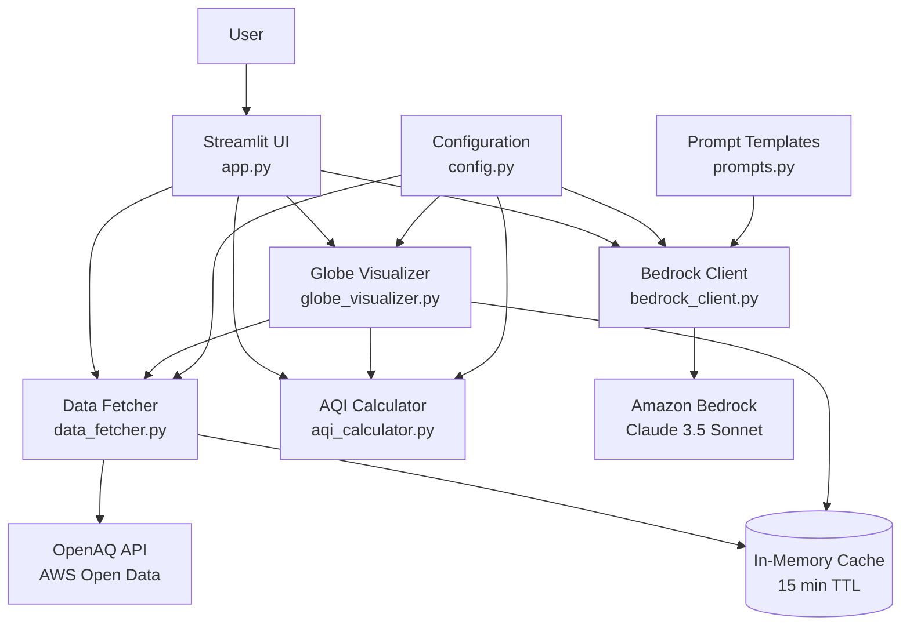

# Design Document: O-Zone MVP

## Overview

O-Zone is an air quality decision platform that integrates real-time air quality data from OpenAQ with AI-powered analysis through Amazon Bedrock to provide personalized outdoor activity recommendations. The system follows a modular architecture with clear separation between data retrieval, calculation, AI analysis, visualization, and presentation layers.

The application is built using Python with Streamlit for the user interface, providing a web-based experience that requires no installation for end users. The system retrieves air quality measurements from the OpenAQ API (hosted on AWS Open Data Registry), calculates standardized AQI values using EPA breakpoint tables, and leverages Claude 3.5 Sonnet via Amazon Bedrock to generate context-aware recommendations based on user activity profiles and health sensitivities. An interactive globe visualization powered by pydeck enables users to explore global air quality data and discover locations visually.

### Technology Stack

- **Frontend**: Streamlit (Python web framework)
- **Globe Visualization**: pydeck (WebGL-based mapping with Deck.gl)
- **AI/ML**: Amazon Bedrock (Claude 3.5 Sonnet)
- **Data Source**: OpenAQ API v3 (AWS Open Data Registry)
- **Charting**: Plotly/Altair for trend visualizations
- **Testing**: pytest, Hypothesis (property-based testing)
- **Caching**: In-memory caching with TTL

### Key Design Principles

1. **Modularity**: Each component (data fetching, AQI calculation, AI analysis, UI) operates independently with well-defined interfaces
2. **Graceful Degradation**: System provides useful information even when some data sources are unavailable
3. **Performance**: Caching and asynchronous operations minimize latency
4. **User-Centric**: Clear visual feedback, intuitive controls, and plain-language messaging
5. **Extensibility**: Architecture supports adding new pollutants, data sources, or AI models

## Architecture

### System Components



### Component Responsibilities

**app.py (Streamlit UI)**
- Renders 6-section interface: Location Input (with Globe View toggle), Current Conditions, Activity Input, AI Recommendation, Historical Context, Globe Visualization
- Manages UI state and user interactions
- Orchestrates calls to backend components
- Handles loading states and error display
- Manages view switching between text input and globe visualization

**globe_visualizer.py (Globe Visualizer)**
- Renders interactive 3D globe or 2D map visualization
- Fetches global station data from OpenAQ for visible regions
- Manages zoom levels, rotation, and pan interactions
- Renders location markers with AQI-based color coding
- Handles marker clustering at different zoom levels
- Processes click events to select locations
- Generates tooltips with station information
- Implements progressive loading for performance

**data_fetcher.py (Data Fetcher)**
- Interfaces with OpenAQ API v3
- Resolves location names to coordinates/identifiers
- Retrieves current and historical measurements
- Implements caching with 15-minute TTL
- Handles API errors and retries

**aqi_calculator.py (AQI Calculator)**
- Implements EPA AQI calculation algorithm
- Maintains breakpoint tables for all pollutants
- Converts raw concentrations to AQI values
- Determines overall AQI from multiple pollutants
- Validates input ranges

**bedrock_client.py (Bedrock Client)**
- Authenticates with Amazon Bedrock using AWS credentials
- Constructs structured prompts from templates
- Invokes Claude 3.5 Sonnet model
- Parses AI responses into structured data
- Implements retry logic for transient failures

**prompts.py (Prompt Templates)**
- Defines prompt templates for different recommendation types
- Structures context data for AI analysis
- Ensures consistent prompt formatting

**config.py (Configuration)**
- Centralizes all system parameters
- Defines API endpoints and credentials
- Maintains AQI breakpoint tables
- Validates configuration at startup

### Data Flow

1. **User Input Flow**: User enters location → UI validates → Data Fetcher resolves location → OpenAQ API queried
2. **AQI Calculation Flow**: Raw measurements retrieved → AQI Calculator processes each pollutant → Overall AQI determined
3. **Recommendation Flow**: AQI data + user profile → Bedrock Client constructs prompt → Claude generates recommendation → UI displays
4. **Historical Analysis Flow**: Data Fetcher retrieves time-series data → UI renders trend charts → AI Engine analyzes patterns for time window prediction

## Components and Interfaces

### data_fetcher.py

#### Classes

**Location**
```python
@dataclass
class Location:
    name: str
    coordinates: tuple[float, float]  # (latitude, longitude)
    country: str
    providers: list[str]  # Available data providers
```

**Measurement**
```python
@dataclass
class Measurement:
    pollutant: str  # PM2.5, PM10, CO, NO2, O3, SO2
    value: float
    unit: str
    timestamp: datetime
    location: Location
```

#### Functions

**get_location(location_query: str) -> Location | None**
- Resolves user location input to OpenAQ location object
- Searches by city name, coordinates, or region
- Returns None if location not found
- Caches successful resolutions

**get_current_measurements(location: Location) -> list[Measurement]**
- Retrieves latest measurements for all available pollutants
- Filters measurements within last 3 hours
- Returns empty list if no recent data available
- Implements 15-minute cache per location

**get_historical_measurements(location: Location, hours: int) -> dict[str, list[Measurement]]**
- Retrieves time-series data for specified time range
- Returns dict mapping pollutant names to measurement lists
- Used for 24-hour and 7-day trend analysis
- Implements caching with time-range-specific keys

**get_global_stations(bounds: GeoBounds | None = None) -> list[StationSummary]**
- Retrieves list of all monitoring stations globally or within specified bounds
- Returns station metadata including location, coordinates, and latest AQI
- Used by globe visualizer for marker rendering
- Implements aggressive caching (1 hour TTL) due to data volume
- Supports bounding box filtering for viewport-based queries

**_call_openaq_api(endpoint: str, params: dict) -> dict**
- Internal helper for API calls
- Handles authentication and request formatting
- Implements retry logic (1 retry on failure)
- Raises descriptive exceptions on errors

### globe_visualizer.py

#### Classes

**GeoBounds**
```python
@dataclass
class GeoBounds:
    north: float  # Maximum latitude
    south: float  # Minimum latitude
    east: float   # Maximum longitude
    west: float   # Minimum longitude
```

**StationSummary**
```python
@dataclass
class StationSummary:
    station_id: str
    name: str
    coordinates: tuple[float, float]  # (latitude, longitude)
    country: str
    current_aqi: int | None  # None if no recent data
    aqi_category: str | None
    aqi_color: str | None
    last_updated: datetime | None
```

**GlobeState**
```python
@dataclass
class GlobeState:
    center_lat: float
    center_lon: float
    zoom_level: int  # 0 (global) to 15 (city level)
    rotation: float  # Degrees for 3D globe
    selected_station: str | None  # Station ID if selected
```

**MarkerCluster**
```python
@dataclass
class MarkerCluster:
    center_coordinates: tuple[float, float]
    station_count: int
    avg_aqi: int
    aqi_color: str
    stations: list[StationSummary]  # Stations in this cluster
```

#### Functions

**render_globe(state: GlobeState, stations: list[StationSummary]) -> None**
- Renders the interactive globe/map visualization using pydeck
- Applies marker clustering based on zoom level
- Color-codes markers by AQI category
- Handles user interactions (click, zoom, pan, rotate)
- Updates session state on location selection

**get_stations_for_viewport(bounds: GeoBounds) -> list[StationSummary]**
- Retrieves station data for the current viewport
- Calls data_fetcher.get_global_stations with bounds
- Calculates current AQI for each station
- Returns list of StationSummary objects
- Implements viewport-based caching

**cluster_markers(stations: list[StationSummary], zoom_level: int) -> list[MarkerCluster | StationSummary]**
- Applies spatial clustering algorithm based on zoom level
- At low zoom (0-5): aggressive clustering (100+ stations per cluster)
- At medium zoom (6-10): moderate clustering (10-50 stations per cluster)
- At high zoom (11+): minimal or no clustering (individual markers)
- Returns mixed list of clusters and individual stations
- Uses k-means or grid-based clustering for performance

**generate_tooltip(station: StationSummary) -> str**
- Generates HTML tooltip content for station marker
- Includes station name, current AQI, category, and last update time
- Returns formatted HTML string for display
- Handles missing data gracefully (shows "No recent data")

**handle_marker_click(station_id: str) -> Location**
- Processes click event on a station marker
- Retrieves full location details for the station
- Updates UI session state with selected location
- Triggers zoom animation to station location
- Returns Location object for data fetching

**calculate_zoom_bounds(location: tuple[float, float], zoom_level: int) -> GeoBounds**
- Calculates geographic bounds for a given center point and zoom level
- Used to determine which stations to fetch and display
- Returns GeoBounds object
- Accounts for map projection distortion at high latitudes

**get_optimal_zoom_level(bounds: GeoBounds) -> int**
- Determines appropriate zoom level to fit given bounds
- Used when zooming to a selected location
- Returns zoom level (0-15)
- Ensures selected location is prominently displayed

### aqi_calculator.py

#### Classes

**AQIResult**
```python
@dataclass
class AQIResult:
    pollutant: str
    concentration: float
    aqi: int  # 0-500
    category: str  # Good, Moderate, Unhealthy for Sensitive Groups, etc.
    color: str  # Hex color code for UI display
```

**OverallAQI**
```python
@dataclass
class OverallAQI:
    aqi: int  # Maximum of all pollutant AQIs
    category: str
    color: str
    dominant_pollutant: str  # Pollutant with highest AQI
    individual_results: list[AQIResult]
    timestamp: datetime
    location: Location
```

#### Functions

**calculate_aqi(pollutant: str, concentration: float, unit: str) -> AQIResult**
- Converts concentration to standard unit if needed
- Looks up appropriate breakpoint range
- Applies EPA AQI formula: `AQI = ((I_high - I_low) / (C_high - C_low)) * (C - C_low) + I_low`
- Returns AQIResult with category and color
- Raises ValueError if concentration outside valid range

**calculate_overall_aqi(measurements: list[Measurement]) -> OverallAQI**
- Calculates individual AQI for each pollutant
- Determines overall AQI as maximum individual AQI
- Identifies dominant pollutant
- Returns OverallAQI object with all details

**get_aqi_category(aqi: int) -> tuple[str, str]**
- Maps AQI value to category name and color
- Categories: Good (0-50, green), Moderate (51-100, yellow), Unhealthy for Sensitive Groups (101-150, orange), Unhealthy (151-200, red), Very Unhealthy (201-300, purple), Hazardous (301-500, maroon)

#### Breakpoint Tables

Stored in config.py, accessed by aqi_calculator.py:

```python
AQI_BREAKPOINTS = {
    'PM2.5': [  # μg/m³
        (0.0, 12.0, 0, 50),
        (12.1, 35.4, 51, 100),
        (35.5, 55.4, 101, 150),
        (55.5, 150.4, 151, 200),
        (150.5, 250.4, 201, 300),
        (250.5, 500.4, 301, 500),
    ],
    # Similar structures for PM10, CO, NO2, O3, SO2
}
```

### bedrock_client.py

#### Classes

**RecommendationResponse**
```python
@dataclass
class RecommendationResponse:
    safety_assessment: str  # Safe, Moderate Risk, Unsafe
    recommendation_text: str  # Main recommendation paragraph
    precautions: list[str]  # Specific precautions to take
    time_windows: list[TimeWindow]  # Predicted optimal times
    reasoning: str  # AI's reasoning (for debugging/transparency)
```

**TimeWindow**
```python
@dataclass
class TimeWindow:
    start_time: datetime
    end_time: datetime
    expected_aqi_range: tuple[int, int]  # (min, max)
    confidence: str  # High, Medium, Low
```

#### Functions

**get_recommendation(
    overall_aqi: OverallAQI,
    activity: str,
    health_sensitivity: str,
    historical_data: dict[str, list[Measurement]] | None = None
) -> RecommendationResponse**
- Constructs prompt from template with all context
- Calls Claude 3.5 Sonnet via Bedrock
- Parses JSON response into RecommendationResponse
- Implements retry logic (1 retry on failure)
- Returns error-state response if Bedrock unavailable

**_construct_prompt(
    overall_aqi: OverallAQI,
    activity: str,
    health_sensitivity: str,
    historical_data: dict[str, list[Measurement]] | None
) -> str**
- Loads template from prompts.py
- Injects current AQI data, activity profile, health sensitivity
- Includes historical trend summary if available
- Formats as structured prompt for Claude

**_parse_response(response_text: str) -> RecommendationResponse**
- Extracts JSON from Claude response
- Validates required fields present
- Converts strings to appropriate types (datetime, enums)
- Handles malformed responses gracefully

**_call_bedrock(prompt: str) -> str**
- Authenticates using boto3 with AWS credentials
- Invokes bedrock-runtime:InvokeModel API
- Uses Claude 3.5 Sonnet model ID
- Sets temperature=0.7 for balanced creativity/consistency
- Returns raw response text

### prompts.py

#### Templates

**RECOMMENDATION_PROMPT_TEMPLATE**
```python
RECOMMENDATION_PROMPT_TEMPLATE = """
You are an air quality expert providing personalized outdoor activity recommendations.

Current Air Quality Data:
- Overall AQI: {aqi} ({category})
- Dominant Pollutant: {dominant_pollutant} (AQI: {dominant_aqi})
- Individual Pollutants: {individual_pollutants}
- Location: {location}
- Timestamp: {timestamp}

User Profile:
- Planned Activity: {activity}
- Health Sensitivity: {health_sensitivity}

{historical_context}

Provide a recommendation in JSON format with these fields:
- safety_assessment: "Safe", "Moderate Risk", or "Unsafe"
- recommendation_text: Clear guidance paragraph
- precautions: List of specific precautions (empty if safe)
- time_windows: List of optimal time windows in next 24h (if applicable)
- reasoning: Brief explanation of your assessment

Consider:
1. Activity intensity and duration
2. Health sensitivity level
3. Current and predicted AQI trends
4. Specific pollutant risks
"""
```

### config.py

#### Configuration Structure

```python
class Config:
    # API Configuration
    OPENAQ_API_BASE_URL = "https://api.openaq.org/v3"
    OPENAQ_API_KEY = os.getenv("OPENAQ_API_KEY", "")
    
    # AWS Configuration
    AWS_REGION = os.getenv("AWS_REGION", "us-east-1")
    BEDROCK_MODEL_ID = "anthropic.claude-3-5-sonnet-20241022-v2:0"
    
    # Cache Configuration
    CACHE_TTL_SECONDS = 900  # 15 minutes
    DATA_FRESHNESS_HOURS = 3  # Max age for "current" data
    GLOBE_CACHE_TTL_SECONDS = 3600  # 1 hour for global station data
    
    # AQI Configuration
    AQI_BREAKPOINTS = {...}  # Full breakpoint tables
    AQI_CATEGORIES = {...}  # Category definitions
    
    # Globe Visualization Configuration
    GLOBE_LIBRARY = "pydeck"  # Options: pydeck, folium, plotly
    GLOBE_INITIAL_ZOOM = 2  # Global view
    GLOBE_MAX_ZOOM = 15  # City level
    GLOBE_CLUSTER_THRESHOLDS = {
        "low_zoom": (0, 5, 100),    # zoom 0-5: cluster 100+ stations
        "medium_zoom": (6, 10, 50),  # zoom 6-10: cluster 50+ stations
        "high_zoom": (11, 15, 10)    # zoom 11-15: cluster 10+ stations
    }
    GLOBE_MARKER_SIZE_SCALE = 100
    GLOBE_ANIMATION_DURATION_MS = 500
    
    # UI Configuration
    ACTIVITY_OPTIONS = [
        "Walking",
        "Jogging/Running",
        "Cycling",
        "Outdoor Study/Work",
        "Sports Practice",
        "Child Outdoor Play"
    ]
    
    HEALTH_SENSITIVITY_OPTIONS = [
        "None",
        "Allergies",
        "Asthma/Respiratory",
        "Child/Elderly",
        "Pregnant"
    ]
    
    @staticmethod
    def validate():
        """Validates all configuration values at startup"""
        # Check required environment variables
        # Validate breakpoint table structure
        # Verify AWS credentials available
        # Raise ConfigurationError if invalid
```

### app.py (Streamlit UI)

#### UI Structure

The Streamlit app is organized into 6 main sections:

**1. Location Input Section**
- Toggle between text input mode and globe view mode
- Text input for location (city name, coordinates, or region)
- Search button to trigger location resolution
- Display of resolved location name and country
- Error message display for invalid locations
- "Explore Globe" button to switch to globe visualization

**2. Globe Visualization Section** (when globe view active)
- Interactive 3D globe or 2D map powered by pydeck
- Color-coded station markers based on current AQI
- Zoom, pan, and rotation controls
- Marker clustering at lower zoom levels
- Hover tooltips showing station name, AQI, and category
- Click-to-select functionality for stations
- "Return to Search" button to switch back to text input
- Loading indicator during station data fetch

**3. Current Conditions Section**
- Large AQI value display with color-coded background
- AQI category label
- Timestamp of measurements
- Grid of individual pollutant AQI values with mini color indicators
- Loading spinner during data fetch

**4. Activity Input Section**
- Dropdown selector for activity type
- Dropdown selector for health sensitivity
- Auto-refresh toggle (regenerate recommendations on change)

**5. AI Recommendation Section**
- Safety assessment badge (color-coded)
- Main recommendation text
- Expandable precautions list
- Predicted time windows (if available) with time ranges and expected AQI
- Loading spinner during AI analysis
- Fallback message if Bedrock unavailable

**6. Historical Context Section**
- Tab 1: 24-hour trend line chart (AQI over time)
- Tab 2: 7-day pattern chart (daily min/max/avg AQI)
- Color-coded background zones for AQI categories
- Hover tooltips with exact values
- Message if insufficient historical data

#### State Management

```python
# Session state variables
if 'location' not in st.session_state:
    st.session_state.location = None
if 'current_aqi' not in st.session_state:
    st.session_state.current_aqi = None
if 'activity' not in st.session_state:
    st.session_state.activity = "Walking"
if 'health_sensitivity' not in st.session_state:
    st.session_state.health_sensitivity = "None"
if 'recommendation' not in st.session_state:
    st.session_state.recommendation = None
if 'historical_data' not in st.session_state:
    st.session_state.historical_data = None
if 'view_mode' not in st.session_state:
    st.session_state.view_mode = "text_input"  # "text_input" or "globe_view"
if 'globe_state' not in st.session_state:
    st.session_state.globe_state = GlobeState(
        center_lat=0.0, center_lon=0.0, zoom_level=2, rotation=0.0, selected_station=None
    )
if 'visible_stations' not in st.session_state:
    st.session_state.visible_stations = []
```

#### Key Functions

**render_location_input()**
- Renders location search interface
- Handles search button click
- Updates session state with resolved location
- Displays error messages
- Provides toggle to switch to globe view

**render_globe_view()**
- Renders interactive globe/map visualization
- Fetches stations for current viewport
- Handles zoom, pan, and rotation interactions
- Processes marker click events
- Updates session state on location selection
- Provides toggle to return to text input

**render_current_conditions()**
- Displays overall AQI with color coding
- Renders individual pollutant grid
- Shows data timestamp and location
- Handles loading and error states

**render_activity_input()**
- Renders activity and health sensitivity selectors
- Triggers recommendation refresh on change
- Updates session state

**render_recommendation()**
- Displays AI-generated recommendation
- Shows safety assessment badge
- Renders time windows if available
- Handles Bedrock unavailable state

**render_historical_context()**
- Creates 24-hour trend chart using Plotly/Altair
- Creates 7-day pattern chart
- Handles insufficient data gracefully

**fetch_and_update_data()**
- Orchestrates data fetching workflow
- Calls data_fetcher, aqi_calculator, bedrock_client
- Updates all session state variables
- Handles errors at each step

## Data Models

### Core Data Structures

All data models use Python dataclasses for type safety and clarity.

**Location**
- Represents a geographic location with air quality monitoring
- Fields: name (str), coordinates (tuple[float, float]), country (str), providers (list[str])
- Immutable after creation
- Used as key for caching

**Measurement**
- Represents a single air quality measurement
- Fields: pollutant (str), value (float), unit (str), timestamp (datetime), location (Location)
- Pollutant must be one of: PM2.5, PM10, CO, NO2, O3, SO2
- Timestamp stored as UTC datetime
- Value always positive float

**AQIResult**
- Represents calculated AQI for a single pollutant
- Fields: pollutant (str), concentration (float), aqi (int), category (str), color (str)
- AQI constrained to 0-500 range
- Category and color derived from AQI value
- Immutable after calculation

**OverallAQI**
- Represents overall air quality assessment
- Fields: aqi (int), category (str), color (str), dominant_pollutant (str), individual_results (list[AQIResult]), timestamp (datetime), location (Location)
- AQI is maximum of all individual pollutant AQIs
- Dominant pollutant is the one with highest AQI
- Timestamp is most recent measurement timestamp

**RecommendationResponse**
- Represents AI-generated recommendation
- Fields: safety_assessment (str), recommendation_text (str), precautions (list[str]), time_windows (list[TimeWindow]), reasoning (str)
- Safety assessment must be: "Safe", "Moderate Risk", or "Unsafe"
- Precautions list may be empty for safe conditions
- Time windows may be empty if no suitable times predicted

**TimeWindow**
- Represents predicted optimal time period
- Fields: start_time (datetime), end_time (datetime), expected_aqi_range (tuple[int, int]), confidence (str)
- Start time must be before end time
- AQI range is (min, max) expected values
- Confidence is "High", "Medium", or "Low"

**GeoBounds**
- Represents geographic bounding box for viewport queries
- Fields: north (float), south (float), east (float), west (float)
- Latitude values constrained to [-90, 90]
- Longitude values constrained to [-180, 180]
- Used for fetching stations within visible map area

**StationSummary**
- Represents air quality monitoring station for globe visualization
- Fields: station_id (str), name (str), coordinates (tuple[float, float]), country (str), current_aqi (int | None), aqi_category (str | None), aqi_color (str | None), last_updated (datetime | None)
- Lightweight representation for rendering many markers
- AQI fields may be None if no recent data available
- Used by globe visualizer for marker rendering

**GlobeState**
- Represents current state of globe visualization
- Fields: center_lat (float), center_lon (float), zoom_level (int), rotation (float), selected_station (str | None)
- Zoom level ranges from 0 (global view) to 15 (city level)
- Rotation in degrees (0-360) for 3D globe orientation
- Selected station tracks user's current selection

**MarkerCluster**
- Represents clustered group of stations at lower zoom levels
- Fields: center_coordinates (tuple[float, float]), station_count (int), avg_aqi (int), aqi_color (str), stations (list[StationSummary])
- Used to improve performance when rendering many markers
- Average AQI calculated from all stations in cluster
- Color based on average AQI value

### Data Validation Rules

1. All timestamps stored as UTC, converted to local time for display
2. Pollutant names normalized to uppercase (PM2.5, PM10, CO, NO2, O3, SO2)
3. Concentration values must be non-negative
4. AQI values must be integers in range [0, 500]
5. Location coordinates: latitude [-90, 90], longitude [-180, 180]
6. Measurement age validated against DATA_FRESHNESS_HOURS threshold
7. GeoBounds must have north > south and valid latitude/longitude ranges
8. GlobeState zoom_level must be in range [0, 15]
9. MarkerCluster station_count must match length of stations list
10. StationSummary coordinates must be valid lat/lon pairs

### Serialization

All dataclasses support JSON serialization for:
- Caching (in-memory cache stores JSON strings)
- API responses (Bedrock expects/returns JSON)
- Logging and debugging

Custom serialization handles:
- datetime objects → ISO 8601 strings
- tuple coordinates → [lat, lon] arrays
- Nested dataclasses → nested JSON objects


## Correctness Properties

A property is a characteristic or behavior that should hold true across all valid executions of a system-essentially, a formal statement about what the system should do. Properties serve as the bridge between human-readable specifications and machine-verifiable correctness guarantees.

### Property Reflection

After analyzing all acceptance criteria, I identified the following redundancies and consolidations:

1. **Measurement completeness properties (1.2, 1.5, 11.3)**: These all relate to ensuring measurements have required fields. Consolidated into a single property about measurement structure.

2. **AQI calculation properties (2.1, 2.2)**: Both test that valid concentrations produce valid AQI values for all pollutants. Consolidated into one comprehensive property.

3. **Color coding consistency (3.1, 7.3, Usability.3)**: All three test that AQI values map to correct colors. Consolidated into one property.

4. **UI display accuracy (3.3, 3.4, 9.4)**: All test that displayed data matches source data. Consolidated into properties about data display accuracy.

5. **Error handling properties (1.3, 2.5, 11.5)**: All test that invalid inputs produce descriptive errors. Consolidated into properties about error handling per component.

6. **Prompt structure properties (10.2, 10.3)**: Both test that prompts contain required data. Consolidated into one property about prompt completeness.

7. **TimeWindow structure (6.3) and ordering (6.5)**: Combined into a single property that validates TimeWindow objects are well-formed and ordered.

### Properties

### Property 1: Measurement Structure Completeness

*For any* Measurement object returned by the Data Fetcher, it must contain all required fields: pollutant (one of PM2.5, PM10, CO, NO2, O3, SO2), value (non-negative float), unit (string), timestamp (datetime), and location (Location object).

**Validates: Requirements 1.2, 1.5, 11.3**

### Property 2: AQI Calculation Validity

*For any* valid pollutant concentration within the defined breakpoint ranges, the AQI Calculator must return an integer AQI value between 0 and 500 for all supported pollutants (PM2.5, PM10, CO, NO2, O3, SO2).

**Validates: Requirements 2.1, 2.2, 2.4**

### Property 3: Overall AQI Maximum Rule

*For any* set of individual pollutant AQI values, the overall AQI must equal the maximum individual AQI value, and the dominant pollutant must be the one with that maximum AQI.

**Validates: Requirements 2.3**

### Property 4: Out-of-Range Concentration Error Handling

*For any* pollutant concentration outside the defined breakpoint range, the AQI Calculator must return a descriptive error indicating the pollutant and the invalid value.

**Validates: Requirements 2.5**

### Property 5: AQI Color Coding Consistency

*For any* AQI value, the assigned color must match the EPA category: Green (0-50), Yellow (51-100), Orange (101-150), Red (151-200), Purple (201-300), Maroon (301-500), and this mapping must be consistent across all UI components.

**Validates: Requirements 3.1, 7.3, Usability.3**

### Property 6: Safety Assessment Enumeration

*For any* AI-generated recommendation, the safety_assessment field must be exactly one of: "Safe", "Moderate Risk", or "Unsafe".

**Validates: Requirements 5.2**

### Property 7: Precautions for Unsafe Conditions

*For any* recommendation where safety_assessment is "Moderate Risk" or "Unsafe", the precautions list must be non-empty and contain specific guidance.

**Validates: Requirements 5.3**

### Property 8: Health Sensitivity Conservatism

*For any* fixed AQI value and activity, recommendations generated with higher health sensitivity levels (Pregnant > Child/Elderly > Asthma/Respiratory > Allergies > None) must be at least as conservative (same or more restrictive safety assessment).

**Validates: Requirements 5.5**

### Property 9: TimeWindow Structure and Ordering

*For any* list of TimeWindow objects, each must have start_time < end_time, a valid expected_aqi_range tuple, and the list must be sorted chronologically by start_time.

**Validates: Requirements 6.3, 6.5**

### Property 10: TimeWindow Explanation When Empty

*For any* recommendation with an empty time_windows list, the recommendation_text must include an explanation of why no suitable times were found or suggest alternative actions.

**Validates: Requirements 6.4**

### Property 11: Partial Pollutant Data Handling

*For any* subset of pollutants (at least one), the AQI Calculator must successfully calculate an overall AQI using only the available pollutants without error.

**Validates: Requirements 8.1**

### Property 12: Missing Pollutant Indication

*For any* set of measurements where some standard pollutants (PM2.5, PM10, CO, NO2, O3, SO2) are missing, the UI must indicate which specific pollutants have no current data.

**Validates: Requirements 8.2**

### Property 13: Recommendations Without Historical Data

*For any* valid current AQI data, activity, and health sensitivity, the AI Engine must generate a recommendation even when historical_data is None or empty.

**Validates: Requirements 8.4**

### Property 14: Stale Data Marking

*For any* measurement with a timestamp older than 3 hours from the current time, the UI must clearly mark it as outdated or not display it as "current" data.

**Validates: Requirements 8.5**

### Property 15: Location Input Format Support

*For any* location input in the format of city name (string), coordinates (lat,lon), or region identifier, the Data Fetcher must attempt to resolve it to a Location object or return a descriptive error.

**Validates: Requirements 9.1**

### Property 16: Location Validation Response

*For any* location input, the Data Fetcher must return either a valid Location object or an error message (never None without explanation).

**Validates: Requirements 9.2**

### Property 17: Location Not Found Error with Suggestions

*For any* location input that cannot be found in the OpenAQ database, the error message must include suggestions for nearby available locations or alternative search terms.

**Validates: Requirements 9.3**

### Property 18: Bedrock Prompt Completeness

*For any* recommendation request, the constructed prompt must include current AQI data (overall and individual pollutants), Activity_Profile, Health_Sensitivity, and historical trends (if available).

**Validates: Requirements 10.2, 10.3**

### Property 19: Bedrock Retry Logic

*For any* Bedrock API error, the AI Engine must retry exactly once before returning an error to the caller.

**Validates: Requirements 10.4**

### Property 20: Bedrock Response Parsing

*For any* valid Claude JSON response, the AI Engine must successfully parse it into a RecommendationResponse object with all required fields.

**Validates: Requirements 10.5**

### Property 21: OpenAQ Response Parsing

*For any* valid OpenAQ API JSON response containing measurement data, the Data Fetcher must parse it into a list of Measurement objects without error.

**Validates: Requirements 11.1**

### Property 22: Unit Normalization

*For any* measurement with concentration units, the Data Fetcher must convert it to standard units: μg/m³ for particulates (PM2.5, PM10) and ppm for gases (CO, NO2, O3, SO2).

**Validates: Requirements 11.2**

### Property 23: Measurement Serialization Round-Trip

*For any* valid Measurement object, serializing to JSON then deserializing must produce an equivalent Measurement object with all fields equal.

**Validates: Requirements 11.4**

### Property 24: Invalid API Response Error Handling

*For any* malformed or invalid OpenAQ API response, the Data Fetcher must return a parsing error with details about what was invalid.

**Validates: Requirements 11.5**

### Property 25: Configuration Validation Error

*For any* invalid configuration (missing required fields, invalid breakpoint tables, missing AWS credentials), the system must raise a ConfigurationError with specific details and refuse to start.

**Validates: Requirements 12.5**

### Property 26: Cache Behavior

*For any* location queried twice within 15 minutes, the second query must return cached data without making a new API call to OpenAQ.

**Validates: Requirements Performance.4**

### Property 27: Error Logging

*For any* error encountered in any component, the system must create a log entry containing error details (type, message, timestamp, component).

**Validates: Requirements Reliability.1**

### Property 28: Graceful Bedrock Degradation

*For any* request when Amazon Bedrock is unavailable, the system must still display current AQI data and indicate that AI recommendations are temporarily unavailable.

**Validates: Requirements Reliability.3**

### Property 29: API Response Validation

*For any* external API response (OpenAQ or Bedrock), the system must validate the response structure and data types before processing the data.

**Validates: Requirements Reliability.5**

### Property 30: Data Fetcher Error Messages

*For any* OpenAQ API error response, the Data Fetcher must return a user-friendly error message that describes the problem without exposing technical details.

**Validates: Requirements 1.3**

### Property 31: Activity Profile Display Accuracy

*For any* selected Activity_Profile and Health_Sensitivity, the UI must display exactly the values that are currently selected in the session state.

**Validates: Requirements 4.5**

### Property 32: Historical Data Prediction

*For any* valid historical air quality data and current conditions, the AI Engine must include time window predictions in the recommendation response.

**Validates: Requirements 6.1**

### Property 33: Globe Marker Viewport Rendering

*For any* geographic viewport bounds (GeoBounds), the Globe View must render location markers for all monitoring stations within those bounds.

**Validates: Requirements 13.7**

### Property 34: Globe Click-to-Location Selection

*For any* station marker clicked on the globe, the system must zoom to that location, populate the location input field with the station's location, and fetch detailed air quality data for that location.

**Validates: Requirements 13.2, 13.5**

### Property 35: Globe Marker Tooltip Completeness

*For any* station marker with available data, hovering over it must display a tooltip containing the station name, current AQI value, and AQI category.

**Validates: Requirements 13.8**

## Error Handling

### Error Categories

The system handles four categories of errors:

1. **External API Errors**: OpenAQ API failures, Bedrock API failures
2. **Data Validation Errors**: Invalid measurements, out-of-range values, malformed responses
3. **Configuration Errors**: Missing credentials, invalid breakpoint tables, missing required settings
4. **User Input Errors**: Invalid locations, unsupported formats

### Error Handling Strategy

**External API Errors**
- Implement retry logic: 1 retry with exponential backoff (1 second delay)
- Log all API errors with full request/response details
- Return user-friendly error messages without technical jargon
- Graceful degradation: Show available data even if some APIs fail
- Example: If Bedrock fails, show AQI data without recommendations

**Data Validation Errors**
- Validate all external data before processing
- Reject invalid data with specific error messages
- Never crash on bad data - return error state instead
- Log validation failures for debugging
- Example: If AQI calculation receives out-of-range concentration, return error for that pollutant but continue with others

**Configuration Errors**
- Validate all configuration at startup
- Fail fast: Don't start application with invalid config
- Provide specific error messages indicating what's wrong
- Example: "Missing AWS_REGION environment variable for Bedrock authentication"

**User Input Errors**
- Validate location input format
- Provide suggestions for corrections
- Show nearby available locations if exact match not found
- Allow users to retry without restarting
- Example: "Location 'Springfeld' not found. Did you mean 'Springfield, IL'?"

### Error Response Format

All error responses follow a consistent structure:

```python
@dataclass
class ErrorResponse:
    error_type: str  # API_ERROR, VALIDATION_ERROR, CONFIG_ERROR, INPUT_ERROR
    message: str  # User-friendly description
    details: str | None  # Technical details for logging
    suggestions: list[str]  # Actionable suggestions for user
    timestamp: datetime
```

### Logging Strategy

All errors are logged with structured data:

```python
logger.error(
    "Error in component",
    extra={
        "component": "data_fetcher",
        "error_type": "API_ERROR",
        "error_message": str(error),
        "request_params": {...},
        "timestamp": datetime.utcnow().isoformat()
    }
)
```

### Recovery Mechanisms

1. **Retry Logic**: Automatic retry for transient network errors
2. **Caching**: Use cached data if fresh data unavailable
3. **Partial Results**: Show available data even if some components fail
4. **Fallback Values**: Use default values when optional data missing
5. **Session Persistence**: Maintain user state across errors

## Performance Optimizations

### Globe Visualization Performance

The globe visualization must efficiently handle thousands of monitoring stations without degrading user experience. Key optimizations include:

**Marker Clustering**
- Spatial clustering algorithm groups nearby stations at lower zoom levels
- Zoom 0-5: Aggressive clustering (100+ stations per cluster)
- Zoom 6-10: Moderate clustering (10-50 stations per cluster)
- Zoom 11-15: Minimal clustering (individual markers visible)
- Cluster color represents average AQI of grouped stations
- Dynamic reclustering on zoom level changes

**Progressive Loading**
- Viewport-based data fetching: Only load stations within visible bounds
- Lazy loading: Fetch detailed data only when marker clicked
- Prefetching: Load adjacent viewport data during idle time
- Debounced updates: Batch viewport changes to reduce API calls

**Caching Strategy**
- Global station list cached for 1 hour (longer than regular data)
- Viewport-specific queries cached separately
- LRU cache eviction for memory management
- Cache invalidation on explicit user refresh

**Rendering Optimization**
- WebGL-based rendering via pydeck for hardware acceleration
- Marker instancing to reduce draw calls
- Level-of-detail (LOD): Simpler markers at lower zoom levels
- Frustum culling: Don't render markers outside viewport
- Target: 30+ FPS for smooth animations

**Data Transfer Optimization**
- Compressed API responses (gzip)
- Minimal station data in summary objects
- Pagination for large result sets
- Delta updates: Only fetch changed data when possible

### General Performance Targets

- Initial UI load: <2 seconds
- Location search: <5 seconds (including API call)
- AQI calculation: <100ms for 6 pollutants
- AI recommendation: <5 seconds (Bedrock latency)
- Globe view load: <5 seconds (initial station fetch)
- Globe zoom/pan: <100ms response time
- Cache hit rate: >80% for repeated queries

## Testing Strategy

### Dual Testing Approach

The O-Zone MVP will use both unit testing and property-based testing to ensure comprehensive coverage:

**Unit Tests** focus on:
- Specific examples demonstrating correct behavior
- Edge cases (empty data, boundary values, single pollutant)
- Error conditions (API failures, invalid inputs, malformed responses)
- Integration points between components
- UI state transitions

**Property-Based Tests** focus on:
- Universal properties that hold for all inputs
- Comprehensive input coverage through randomization
- Invariants that must always be maintained
- Round-trip properties (serialization/deserialization)
- Relationship properties (e.g., overall AQI = max individual AQI)

Both approaches are complementary and necessary: unit tests catch concrete bugs and verify specific scenarios, while property tests verify general correctness across a wide input space.

### Property-Based Testing Configuration

**Framework**: Hypothesis (Python property-based testing library)

**Configuration**:
- Minimum 100 iterations per property test (due to randomization)
- Deadline: 5 seconds per test case (to handle API mocking)
- Shrinking enabled to find minimal failing examples
- Seed randomization for reproducibility

**Test Tagging**:
Each property test must include a comment referencing its design document property:

```python
@given(st.floats(min_value=0, max_value=1000))
def test_aqi_calculation_validity(concentration):
    """
    Feature: ozone-mvp, Property 2: AQI Calculation Validity
    For any valid pollutant concentration within the defined breakpoint ranges,
    the AQI Calculator must return an integer AQI value between 0 and 500.
    """
    # Test implementation
```

### Test Organization

```
tests/
├── unit/
│   ├── test_data_fetcher.py
│   ├── test_aqi_calculator.py
│   ├── test_bedrock_client.py
│   ├── test_globe_visualizer.py
│   └── test_ui_components.py
├── property/
│   ├── test_properties_data_fetcher.py
│   ├── test_properties_aqi_calculator.py
│   ├── test_properties_bedrock_client.py
│   ├── test_properties_globe_visualizer.py
│   └── test_properties_integration.py
├── integration/
│   ├── test_end_to_end_flow.py
│   ├── test_globe_interaction_flow.py
│   └── test_error_scenarios.py
└── conftest.py  # Shared fixtures and mocks
```

### Unit Test Examples

**Data Fetcher Unit Tests**:
- Test successful location resolution for "San Francisco"
- Test empty result when no measurements available
- Test API error handling with 500 status code
- Test caching behavior with repeated queries
- Test unit conversion from mg/m³ to μg/m³

**AQI Calculator Unit Tests**:
- Test AQI calculation for PM2.5 = 35.4 μg/m³ (boundary value)
- Test overall AQI with multiple pollutants
- Test error for concentration = -1 (invalid)
- Test single pollutant AQI calculation
- Test all six pollutant types

**Bedrock Client Unit Tests**:
- Test prompt construction with all required fields
- Test response parsing for valid JSON
- Test retry logic with mocked API failure
- Test graceful handling of malformed response
- Test recommendation without historical data

**UI Unit Tests**:
- Test AQI color assignment for each category
- Test loading state display during data fetch
- Test error message display for invalid location
- Test activity selector contains all options
- Test time window display ordering

**Globe Visualizer Unit Tests**:
- Test marker clustering at zoom level 3 (should cluster)
- Test marker clustering at zoom level 12 (minimal clustering)
- Test tooltip generation with complete station data
- Test tooltip generation with missing AQI data
- Test viewport bounds calculation for zoom level 5
- Test click handler updates session state correctly
- Test globe view toggle switches between text and globe modes

### Property-Based Test Examples

**Property 2: AQI Calculation Validity**
```python
@given(
    pollutant=st.sampled_from(['PM2.5', 'PM10', 'CO', 'NO2', 'O3', 'SO2']),
    concentration=st.floats(min_value=0, max_value=500, allow_nan=False)
)
def test_aqi_calculation_validity(pollutant, concentration):
    """Feature: ozone-mvp, Property 2"""
    try:
        result = calculate_aqi(pollutant, concentration, 'μg/m³')
        assert isinstance(result.aqi, int)
        assert 0 <= result.aqi <= 500
    except ValueError:
        # Out of range is acceptable, but must be explicit error
        pass
```

**Property 3: Overall AQI Maximum Rule**
```python
@given(st.lists(st.integers(min_value=0, max_value=500), min_size=1, max_size=6))
def test_overall_aqi_maximum_rule(individual_aqis):
    """Feature: ozone-mvp, Property 3"""
    # Create mock measurements with given AQIs
    measurements = create_mock_measurements_with_aqis(individual_aqis)
    overall = calculate_overall_aqi(measurements)
    assert overall.aqi == max(individual_aqis)
```

**Property 23: Measurement Serialization Round-Trip**
```python
@given(
    pollutant=st.sampled_from(['PM2.5', 'PM10', 'CO', 'NO2', 'O3', 'SO2']),
    value=st.floats(min_value=0, max_value=1000, allow_nan=False),
    timestamp=st.datetimes(min_value=datetime(2020, 1, 1))
)
def test_measurement_serialization_roundtrip(pollutant, value, timestamp):
    """Feature: ozone-mvp, Property 23"""
    location = Location("Test City", (37.7, -122.4), "US", ["test"])
    measurement = Measurement(pollutant, value, "μg/m³", timestamp, location)
    
    json_str = measurement.to_json()
    deserialized = Measurement.from_json(json_str)
    
    assert deserialized == measurement
```

**Property 5: AQI Color Coding Consistency**
```python
@given(st.integers(min_value=0, max_value=500))
def test_aqi_color_coding_consistency(aqi):
    """Feature: ozone-mvp, Property 5"""
    category, color = get_aqi_category(aqi)
    
    # Verify color matches category
    expected_colors = {
        'Good': '#00E400',
        'Moderate': '#FFFF00',
        'Unhealthy for Sensitive Groups': '#FF7E00',
        'Unhealthy': '#FF0000',
        'Very Unhealthy': '#8F3F97',
        'Hazardous': '#7E0023'
    }
    
    assert color == expected_colors[category]
```

**Property 33: Globe Marker Viewport Rendering**
```python
@given(
    north=st.floats(min_value=-90, max_value=90),
    south=st.floats(min_value=-90, max_value=90),
    east=st.floats(min_value=-180, max_value=180),
    west=st.floats(min_value=-180, max_value=180)
)
def test_globe_marker_viewport_rendering(north, south, east, west):
    """Feature: ozone-mvp, Property 33"""
    assume(north > south)  # Valid bounds
    
    bounds = GeoBounds(north, south, east, west)
    stations = get_stations_for_viewport(bounds)
    
    # All returned stations must be within bounds
    for station in stations:
        lat, lon = station.coordinates
        assert south <= lat <= north
        # Handle longitude wraparound for east/west
```

**Property 34: Globe Click-to-Location Selection**
```python
@given(
    lat=st.floats(min_value=-90, max_value=90),
    lon=st.floats(min_value=-180, max_value=180)
)
def test_globe_click_to_location_selection(lat, lon):
    """Feature: ozone-mvp, Property 34"""
    # Create mock station at coordinates
    station = create_mock_station(lat, lon)
    
    # Simulate click
    location = handle_marker_click(station.station_id)
    
    # Verify location populated and data fetch triggered
    assert location is not None
    assert location.coordinates == (lat, lon)
```

**Property 35: Globe Marker Tooltip Completeness**
```python
@given(
    station_name=st.text(min_size=1, max_size=100),
    aqi=st.integers(min_value=0, max_value=500)
)
def test_globe_marker_tooltip_completeness(station_name, aqi):
    """Feature: ozone-mvp, Property 35"""
    category, color = get_aqi_category(aqi)
    station = StationSummary(
        station_id="test",
        name=station_name,
        coordinates=(0, 0),
        country="US",
        current_aqi=aqi,
        aqi_category=category,
        aqi_color=color,
        last_updated=datetime.utcnow()
    )
    
    tooltip = generate_tooltip(station)
    
    # Verify tooltip contains required information
    assert station_name in tooltip
    assert str(aqi) in tooltip
    assert category in tooltip
```

### Mocking Strategy

**OpenAQ API Mocking**:
- Use `responses` library to mock HTTP requests
- Create fixtures for common response patterns
- Test both successful and error responses
- Mock rate limiting and timeouts

**Bedrock API Mocking**:
- Use `moto` library to mock AWS services
- Create fixtures for Claude responses
- Test retry logic with transient failures
- Mock authentication and authorization

**Time Mocking**:
- Use `freezegun` to control time in tests
- Test cache expiration behavior
- Test data freshness validation
- Test time window predictions

### Integration Testing

**End-to-End Flow Tests**:
1. User enters location → Data fetched → AQI calculated → Recommendation generated → UI updated
2. User changes activity → Recommendation regenerated with new context
3. API failure → Error displayed → User retries → Success
4. Cached data used → No API call made → Fresh data after cache expiry
5. User clicks "Explore Globe" → Globe view loads → User clicks marker → Location selected → Data displayed

**Globe Interaction Flow Tests**:
1. User opens globe view → Stations load → User zooms in → Markers decluster → User clicks marker → Location populated
2. User pans globe → New viewport stations load → Cached stations reused when panning back
3. User clicks marker with no recent data → Tooltip shows "No recent data" → Click still selects location

**Error Scenario Tests**:
1. OpenAQ API returns 500 error → Retry → Success
2. Bedrock unavailable → AQI shown without recommendations
3. Invalid location → Error with suggestions → User corrects → Success
4. Partial pollutant data → AQI calculated with available data → Missing pollutants indicated

### Test Coverage Goals

- Line coverage: >90% for all modules
- Branch coverage: >85% for all modules
- Property test coverage: All 35 properties implemented
- Unit test coverage: All edge cases and error conditions
- Integration test coverage: All major user flows

### Continuous Testing

- Run unit tests on every commit
- Run property tests on every pull request
- Run integration tests before deployment
- Monitor test execution time (target: <2 minutes for full suite)
- Track flaky tests and fix immediately
