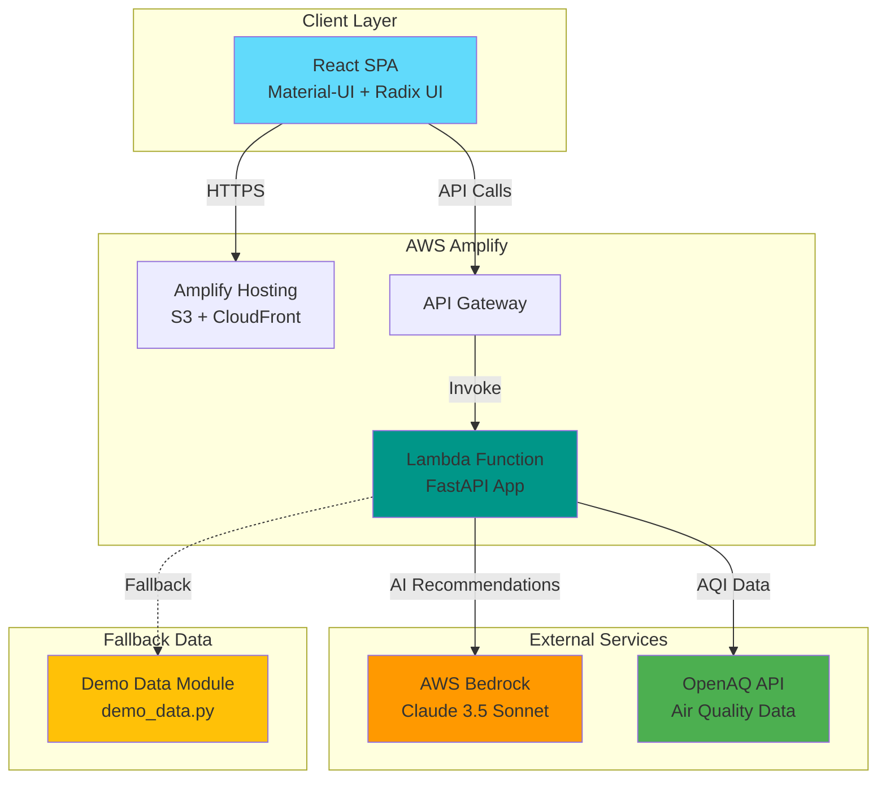
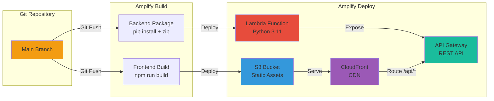

# Design Document: React UI Backend Integration

## Overview

This design document outlines the architecture for integrating the React/TypeScript UI with the existing Python backend for a hackathon demo deployment on AWS Amplify. The solution prioritizes rapid implementation, demo-readiness, and core functionality while maintaining code quality and extensibility.

### Goals

- Extract REST API from existing Streamlit application
- Connect React UI to Python backend via RESTful endpoints
- Deploy full-stack application to AWS Amplify with automated CI/CD
- Maintain existing functionality (chatbot, AQI data, AI recommendations)
- Enable demo-ready deployment within hackathon timeframe

### Non-Goals

- Production-grade authentication/authorization (demo uses open access)
- Complex state management (Context API sufficient for demo)
- Database persistence (in-memory session management acceptable)
- Comprehensive monitoring/observability (basic CloudWatch sufficient)
- Multi-region deployment

### Key Design Decisions

1. **Backend Framework**: FastAPI (chosen for speed, automatic OpenAPI docs, async support)
2. **API Structure**: 6 core endpoints covering location search, AQI data, chat, recommendations, map data, health check
3. **Deployment**: AWS Amplify with monorepo structure (frontend + backend in same repo)
4. **Lambda Organization**: Single Lambda function with FastAPI routing (simpler for demo)
5. **Frontend API Client**: Axios with custom hooks (react-query adds complexity for demo scope)
6. **State Management**: React Context API (Redux unnecessary for demo complexity)
7. **Session Management**: In-memory with TTL (DynamoDB adds deployment complexity)
8. **Demo Data Strategy**: Existing demo_data.py module with fallback logic
9. **Environment Variables**: Amplify environment variables + .env files for local dev

## Architecture

### System Architecture



### Request Flow

1. **User Interaction**: User interacts with React UI (search location, view AQI, chat)
2. **API Request**: React component calls API via axios client
3. **API Gateway**: Routes request to Lambda function
4. **FastAPI Routing**: Lambda processes request through FastAPI router
5. **Business Logic**: Calls existing Python modules (data_fetcher, bedrock_client, etc.)
6. **External APIs**: Fetches data from OpenAQ/Bedrock or falls back to demo data
7. **Response**: JSON response returned through API Gateway to React UI
8. **UI Update**: React component updates state and re-renders

### Deployment Architecture



## Components and Interfaces

### Backend API Components

#### 1. FastAPI Application (`src/api/main.py`)

Main FastAPI application with CORS middleware and route registration.

```python
from fastapi import FastAPI
from fastapi.middleware.cors import CORSMiddleware
from mangum import Mangum

app = FastAPI(
    title="O-Zone API",
    description="Air quality decision platform API",
    version="1.0.0"
)

# CORS configuration for demo (allow all origins)
app.add_middleware(
    CORSMiddleware,
    allow_origins=["*"],
    allow_credentials=True,
    allow_methods=["*"],
    allow_headers=["*"],
)

# Lambda handler
handler = Mangum(app)
```

#### 2. Location Router (`src/api/routers/locations.py`)

Handles location search and AQI data retrieval.

**Endpoints**:
- `GET /api/locations/search?q={query}` - Search for locations
- `GET /api/locations/{location_id}/aqi` - Get current AQI for location

**Dependencies**: `data_fetcher.py`, `aqi_calculator.py`

#### 3. Chat Router (`src/api/routers/chat.py`)

Handles chatbot interactions with session management.

**Endpoints**:
- `POST /api/chat` - Send message and receive response

**Dependencies**: `chatbot/`, `bedrock_client.py`

#### 4. Recommendations Router (`src/api/routers/recommendations.py`)

Generates AI-powered activity recommendations.

**Endpoints**:
- `GET /api/recommendations?location={id}&activity={activity}&health={sensitivity}` - Get recommendations

**Dependencies**: `bedrock_client.py`, `aqi_calculator.py`

#### 5. Map Router (`src/api/routers/map.py`)

Provides global station data for map visualization.

**Endpoints**:
- `GET /api/stations/map?bounds={north,south,east,west}` - Get stations for map

**Dependencies**: `data_fetcher.py`, `demo_data.py`

#### 6. Health Router (`src/api/routers/health.py`)

Health check endpoint for monitoring.

**Endpoints**:
- `GET /api/health` - Health check

### Frontend Components

#### 1. API Client (`src/api/client.ts`)

Centralized axios client with interceptors and error handling.

```typescript
import axios from 'axios';

const apiClient = axios.create({
  baseURL: import.meta.env.VITE_API_URL || 'http://localhost:8000',
  timeout: 30000,
  headers: {
    'Content-Type': 'application/json',
  },
});

// Request interceptor for logging
apiClient.interceptors.request.use(
  (config) => {
    console.log(`API Request: ${config.method?.toUpperCase()} ${config.url}`);
    return config;
  },
  (error) => Promise.reject(error)
);

// Response interceptor for error handling
apiClient.interceptors.response.use(
  (response) => response,
  (error) => {
    if (error.response) {
      console.error(`API Error: ${error.response.status}`, error.response.data);
    } else if (error.request) {
      console.error('Network Error:', error.message);
    }
    return Promise.reject(error);
  }
);

export default apiClient;
```

#### 2. API Service Layer (`src/services/`)

Service modules for each API domain:
- `locationService.ts` - Location search and AQI data
- `chatService.ts` - Chat interactions
- `recommendationService.ts` - Activity recommendations
- `mapService.ts` - Map data

#### 3. Custom Hooks (`src/hooks/`)

React hooks for API interactions with loading/error states:
- `useLocationSearch.ts`
- `useAQIData.ts`
- `useChat.ts`
- `useRecommendations.ts`
- `useMapStations.ts`

#### 4. Context Providers (`src/context/`)

Global state management:
- `LocationContext.tsx` - Current location and AQI data
- `ChatContext.tsx` - Chat session and history
- `AppContext.tsx` - App-wide settings and preferences

### API Contracts

#### Location Search Response

```typescript
interface LocationSearchResponse {
  results: Array<{
    id: string;
    name: string;
    country: string;
    coordinates: {
      latitude: number;
      longitude: number;
    };
    providers: string[];
  }>;
  metadata: {
    source: 'api' | 'demo' | 'ai';
    timestamp: string;
  };
}
```

#### AQI Data Response

```typescript
interface AQIResponse {
  location: {
    id: string;
    name: string;
    country: string;
  };
  overall: {
    aqi: number;
    category: string;
    color: string;
    dominant_pollutant: string;
    timestamp: string;
  };
  pollutants: Array<{
    name: string;
    aqi: number;
    category: string;
    color: string;
    value: number;
    unit: string;
  }>;
  metadata: {
    source: 'api' | 'demo' | 'ai';
  };
}
```

#### Chat Request/Response

```typescript
interface ChatRequest {
  message: string;
  session_id?: string;
  context?: {
    location?: string;
    current_aqi?: number;
  };
}

interface ChatResponse {
  response: string;
  session_id: string;
  timestamp: string;
  metadata: {
    model: string;
    source: 'bedrock' | 'fallback';
  };
}
```

#### Recommendations Response

```typescript
interface RecommendationResponse {
  safety_assessment: 'Safe' | 'Moderate Risk' | 'Unsafe';
  recommendation_text: string;
  precautions: string[];
  time_windows: Array<{
    start_time: string;
    end_time: string;
    expected_aqi_range: [number, number];
    confidence: string;
  }>;
  reasoning: string;
  metadata: {
    source: 'ai' | 'rule-based';
  };
}
```

#### Map Stations Response

```typescript
interface MapStationsResponse {
  stations: Array<{
    id: string;
    name: string;
    country: string;
    coordinates: {
      latitude: number;
      longitude: number;
    };
    current_aqi: number | null;
    aqi_category: string | null;
    aqi_color: string | null;
    last_updated: string | null;
  }>;
  metadata: {
    count: number;
    source: 'api' | 'demo';
    bounds?: {
      north: number;
      south: number;
      east: number;
      west: number;
    };
  };
}
```

## Data Models

### Backend Models (Python)

Existing models in `src/models.py` will be reused:
- `Location` - Geographic location with coordinates
- `Measurement` - Pollutant measurement with timestamp
- `OverallAQI` - Calculated AQI with category and color
- `RecommendationResponse` - AI recommendation with precautions
- `StationSummary` - Station metadata for map visualization
- `GeoBounds` - Geographic bounding box

### Frontend Models (TypeScript)

TypeScript interfaces matching backend models:

```typescript
// src/types/location.ts
export interface Location {
  id: string;
  name: string;
  country: string;
  coordinates: {
    latitude: number;
    longitude: number;
  };
  providers: string[];
}

// src/types/aqi.ts
export interface AQIData {
  location: Location;
  overall: {
    aqi: number;
    category: string;
    color: string;
    dominant_pollutant: string;
    timestamp: string;
  };
  pollutants: Pollutant[];
}

export interface Pollutant {
  name: string;
  aqi: number;
  category: string;
  color: string;
  value: number;
  unit: string;
}

// src/types/recommendation.ts
export interface Recommendation {
  safety_assessment: 'Safe' | 'Moderate Risk' | 'Unsafe';
  recommendation_text: string;
  precautions: string[];
  time_windows: TimeWindow[];
  reasoning: string;
}

export interface TimeWindow {
  start_time: string;
  end_time: string;
  expected_aqi_range: [number, number];
  confidence: string;
}

// src/types/chat.ts
export interface ChatMessage {
  id: string;
  role: 'user' | 'assistant';
  content: string;
  timestamp: string;
}

export interface ChatSession {
  session_id: string;
  messages: ChatMessage[];
}

// src/types/map.ts
export interface Station {
  id: string;
  name: string;
  country: string;
  coordinates: {
    latitude: number;
    longitude: number;
  };
  current_aqi: number | null;
  aqi_category: string | null;
  aqi_color: string | null;
  last_updated: string | null;
}
```

### Session Management

In-memory session storage with TTL for demo:

```python
# src/api/session.py
from datetime import datetime, timedelta, UTC
from typing import Dict, Any
import uuid

class SessionManager:
    def __init__(self, ttl_minutes: int = 30):
        self._sessions: Dict[str, Dict[str, Any]] = {}
        self._ttl = timedelta(minutes=ttl_minutes)
    
    def create_session(self) -> str:
        session_id = str(uuid.uuid4())
        self._sessions[session_id] = {
            'created_at': datetime.now(UTC),
            'last_accessed': datetime.now(UTC),
            'data': {}
        }
        return session_id
    
    def get_session(self, session_id: str) -> Dict[str, Any]:
        if session_id not in self._sessions:
            return None
        
        session = self._sessions[session_id]
        
        # Check TTL
        if datetime.now(UTC) - session['last_accessed'] > self._ttl:
            del self._sessions[session_id]
            return None
        
        session['last_accessed'] = datetime.now(UTC)
        return session['data']
    
    def update_session(self, session_id: str, data: Dict[str, Any]) -> bool:
        if session_id not in self._sessions:
            return False
        
        self._sessions[session_id]['data'].update(data)
        self._sessions[session_id]['last_accessed'] = datetime.now(UTC)
        return True
    
    def cleanup_expired(self):
        """Remove expired sessions"""
        now = datetime.now(UTC)
        expired = [
            sid for sid, session in self._sessions.items()
            if now - session['last_accessed'] > self._ttl
        ]
        for sid in expired:
            del self._sessions[sid]

# Global session manager instance
session_manager = SessionManager(ttl_minutes=30)
```

