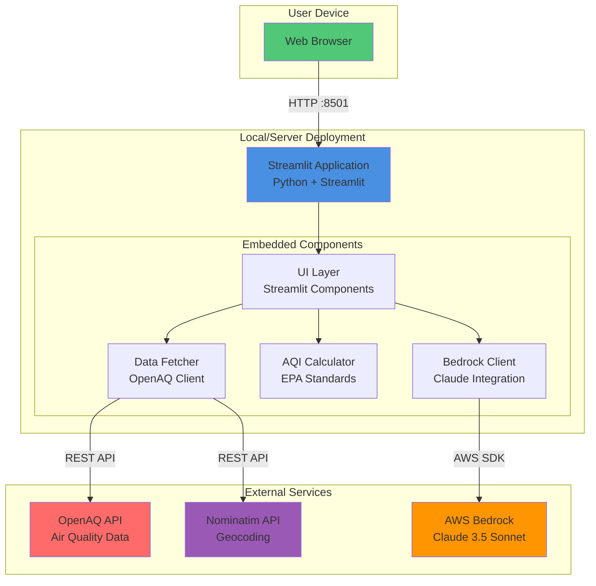
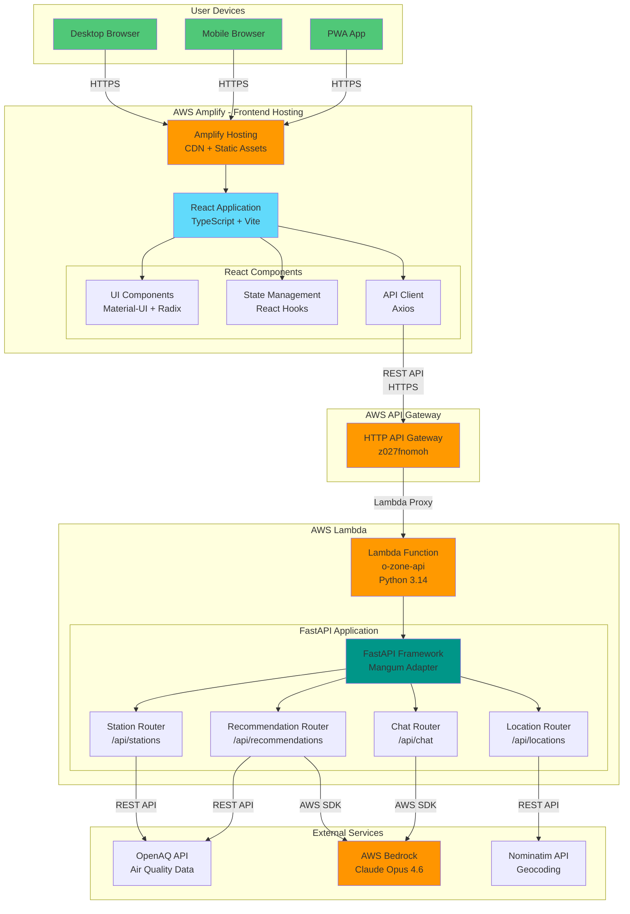
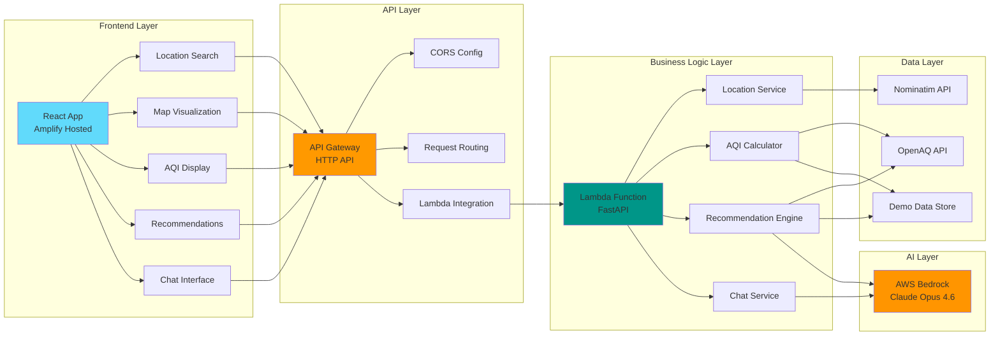
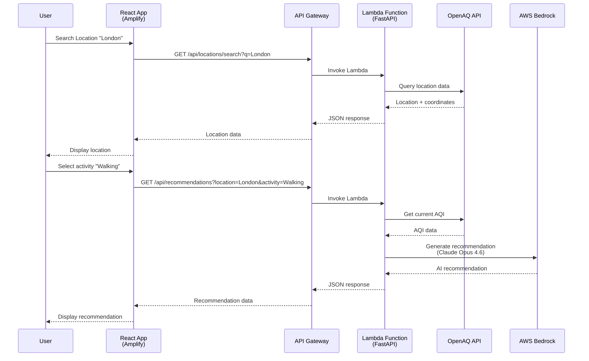
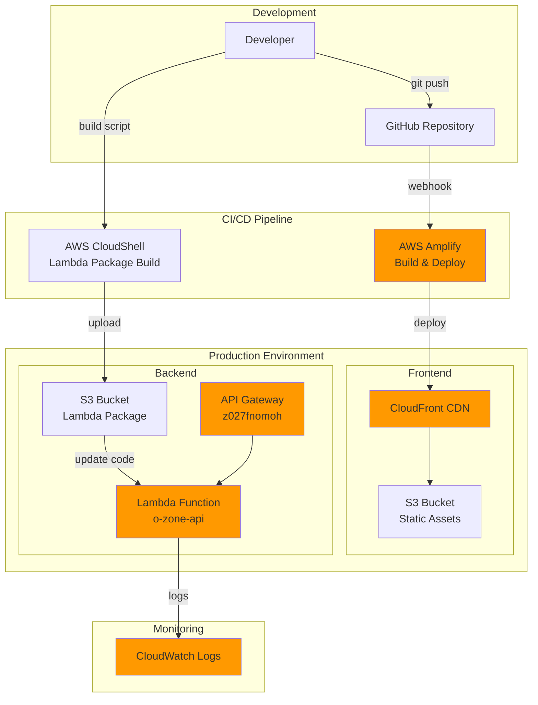

# O-Zone Architecture Documentation

This document describes the two deployment architectures for the O-Zone Air Quality Decision Platform.

---

## System 1: Streamlit Application (Development/Prototype)

### Architecture Overview



### Component Details

**Technology Stack:**
- **Frontend**: Streamlit (Python-based UI framework)
- **Backend**: Embedded Python modules
- **Visualization**: Plotly, Folium (OpenStreetMap)
- **Deployment**: Single server (local or cloud VM)

**Key Features:**
- Monolithic architecture (UI + Backend in one app)
- Real-time interactive components
- Session-based state management
- Direct API calls from server

**Deployment Options:**
- Local: `streamlit run src/app.py`
- Server: Streamlit Cloud, EC2, or any Python hosting

**Limitations:**
- Single server scalability
- Limited mobile optimization
- Stateful sessions (not horizontally scalable)

---

## System 2: React + AWS Serverless (Production)

### Architecture Overview



### Detailed Component Architecture



### Technology Stack

**Frontend:**
- React 18.3.1 + TypeScript
- Vite 6.3.5 (build tool)
- Material-UI 7.3.5
- Radix UI (accessible components)
- Axios (HTTP client)
- React Router 7.13.0

**Backend:**
- FastAPI (Python web framework)
- Mangum (AWS Lambda adapter)
- Pydantic 2.10+ (data validation)
- Python 3.14

**AWS Services:**
- Amplify (frontend hosting + CI/CD)
- Lambda (serverless compute)
- API Gateway (HTTP API)
- Bedrock (AI/ML inference)
- S3 (Lambda package storage)

**External APIs:**
- OpenAQ (air quality data)
- Nominatim (geocoding)

### Data Flow



### Deployment Architecture



### API Endpoints

**Base URL:** `https://z027fnomoh.execute-api.us-east-1.amazonaws.com`

| Endpoint | Method | Description |
|----------|--------|-------------|
| `/api/health` | GET | Health check |
| `/api/locations/search` | GET | Search locations by name |
| `/api/stations/map` | GET | Get global monitoring stations |
| `/api/recommendations` | GET | Get AI-powered recommendations |
| `/api/chat` | POST | Chat with AI assistant |

### Environment Configuration

**Amplify Environment Variables:**
```
VITE_API_URL=https://z027fnomoh.execute-api.us-east-1.amazonaws.com
```

**Lambda Environment Variables:**
```
OZONE_AWS_REGION=us-east-1
OZONE_AWS_ACCESS_KEY_ID=<credentials>
OZONE_AWS_SESSION_TOKEN=<token>
BEDROCK_MODEL_ID=arn:aws:bedrock:us-east-1:559050222547:inference-profile/global.anthropic.claude-opus-4-6-v1
OPENAQ_API_KEY=<api-key>
```

### Scalability & Performance

**Frontend (Amplify):**
- Global CDN distribution
- Automatic scaling
- Edge caching
- HTTPS by default

**Backend (Lambda):**
- Auto-scaling (0 to 1000s of concurrent executions)
- Pay-per-request pricing
- 512 MB memory allocation
- 30-second timeout
- Cold start: ~2 seconds
- Warm execution: ~100-300ms

**API Gateway:**
- 10,000 requests/second default limit
- Automatic DDoS protection
- Request throttling
- CORS enabled

### Security

**Frontend:**
- HTTPS only
- Content Security Policy
- XSS protection
- CORS configured

**Backend:**
- IAM role-based access
- API Gateway authorization
- Lambda execution role
- Environment variable encryption
- VPC isolation (optional)

**AI/ML:**
- Bedrock IAM permissions
- Model access controls
- Request/response logging

---

## Comparison: Streamlit vs React + Lambda

| Feature | Streamlit App | React + Lambda |
|---------|---------------|----------------|
| **Architecture** | Monolithic | Microservices |
| **Scalability** | Vertical (single server) | Horizontal (serverless) |
| **Cost** | Fixed (server cost) | Variable (pay-per-use) |
| **Deployment** | Manual or Streamlit Cloud | Automated CI/CD |
| **Mobile Support** | Basic responsive | Full PWA support |
| **API** | Internal functions | RESTful API |
| **State Management** | Server-side sessions | Client-side + API |
| **Cold Start** | N/A (always running) | ~2 seconds |
| **Concurrent Users** | Limited by server | Unlimited (auto-scale) |
| **Development Speed** | Fast (Python only) | Moderate (Full-stack) |
| **Production Ready** | Prototype/Demo | Enterprise-grade |
| **Maintenance** | Server management | Serverless (AWS managed) |

---

## Recommended Use Cases

### Streamlit App
- Internal tools and dashboards
- Data science prototypes
- Quick MVPs and demos
- Development and testing
- Small user base (<100 concurrent)

### React + Lambda
- Production applications
- Public-facing websites
- Mobile-first applications
- High-traffic scenarios
- Enterprise deployments
- Global user base

---

## URLs

**Streamlit App (Local):**
- `http://localhost:8501`

**React + Lambda (Production):**
- Frontend: `https://main.d32w9y2132m03m.amplifyapp.com`
- Backend API: `https://z027fnomoh.execute-api.us-east-1.amazonaws.com`

---

## Cost Estimation (React + Lambda)

**Monthly Costs (estimated for 10,000 users):**

| Service | Usage | Cost |
|---------|-------|------|
| Amplify Hosting | 100 GB bandwidth | $1.50 |
| Lambda | 1M requests, 512MB | $0.20 |
| API Gateway | 1M requests | $1.00 |
| Bedrock (Claude) | 100K recommendations | $40.00 |
| CloudWatch Logs | 10 GB | $5.00 |
| **Total** | | **~$48/month** |

**Streamlit App (EC2 t3.medium):**
- Fixed cost: ~$30-40/month (24/7 running)
- Does not auto-scale

---

## Future Enhancements

**Potential Additions:**
- DynamoDB for caching AQI data
- ElastiCache for session management
- Cognito for user authentication
- S3 for user preferences storage
- CloudFront for additional caching
- WAF for advanced security
- Route53 for custom domain

---

*Last Updated: March 1, 2026*
